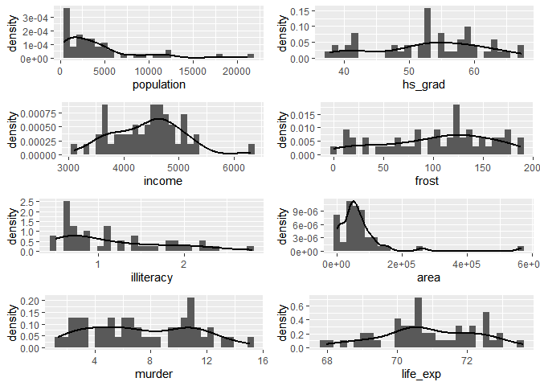
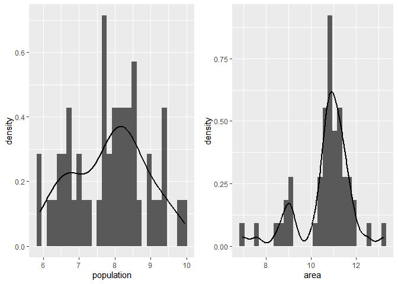
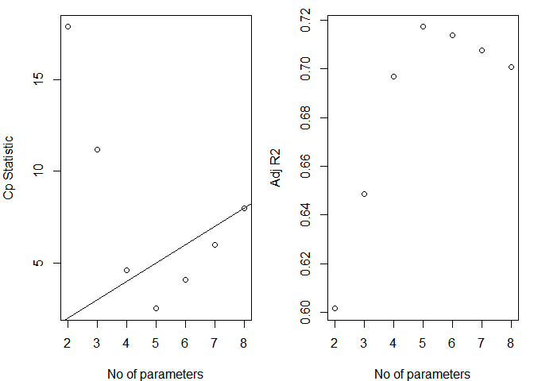
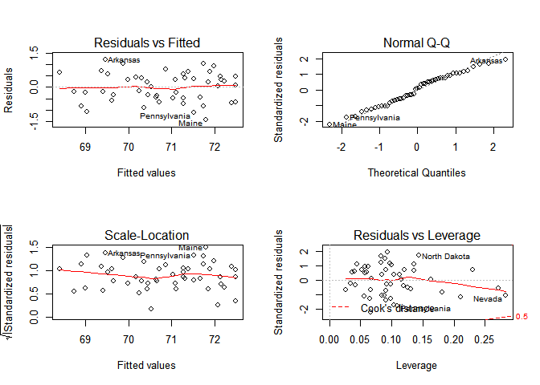
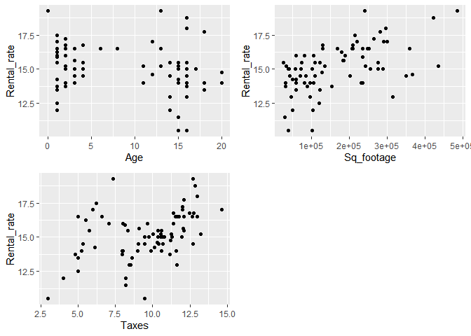
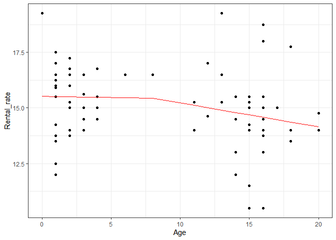

p8130\_hw5\_rq2166
================
Ruoyuan Qian

# Problem 1

## a)

``` r
state.x77 = 
  state.x77 %>% 
  as.data.frame() %>% 
  janitor::clean_names()
```

    ## Warning in FUN(X[[i]], ...): strings not representable in native encoding
    ## will be translated to UTF-8

``` r
 sum_data  <-  arsenal::tableby( ~ ., 
                                data  = state.x77,
                                test  = FALSE, 
                                total = FALSE,
                                numeric.stats =
                                  c("meansd","medianq1q3","range"))
summ = summary(sum_data,text = TRUE)
summ
```

    ## 
    ## 
    ## |                   |          Overall (N=50)          |
    ## |:------------------|:--------------------------------:|
    ## |population         |                                  |
    ## |-  Mean (SD)       |       4246.420 (4464.491)        |
    ## |-  Median (Q1, Q3) |  2838.500 (1079.500, 4968.500)   |
    ## |-  Range           |       365.000 - 21198.000        |
    ## |income             |                                  |
    ## |-  Mean (SD)       |        4435.800 (614.470)        |
    ## |-  Median (Q1, Q3) |  4519.000 (3992.750, 4813.500)   |
    ## |-  Range           |       3098.000 - 6315.000        |
    ## |illiteracy         |                                  |
    ## |-  Mean (SD)       |          1.170 (0.610)           |
    ## |-  Median (Q1, Q3) |       0.950 (0.625, 1.575)       |
    ## |-  Range           |          0.500 - 2.800           |
    ## |life_exp           |                                  |
    ## |-  Mean (SD)       |          70.879 (1.342)          |
    ## |-  Median (Q1, Q3) |     70.675 (70.117, 71.893)      |
    ## |-  Range           |         67.960 - 73.600          |
    ## |murder             |                                  |
    ## |-  Mean (SD)       |          7.378 (3.692)           |
    ## |-  Median (Q1, Q3) |      6.850 (4.350, 10.675)       |
    ## |-  Range           |          1.400 - 15.100          |
    ## |hs_grad            |                                  |
    ## |-  Mean (SD)       |          53.108 (8.077)          |
    ## |-  Median (Q1, Q3) |     53.250 (48.050, 59.150)      |
    ## |-  Range           |         37.800 - 67.300          |
    ## |frost              |                                  |
    ## |-  Mean (SD)       |         104.460 (51.981)         |
    ## |-  Median (Q1, Q3) |    114.500 (66.250, 139.750)     |
    ## |-  Range           |         0.000 - 188.000          |
    ## |area               |                                  |
    ## |-  Mean (SD)       |      70735.880 (85327.300)       |
    ## |-  Median (Q1, Q3) | 54277.000 (36985.250, 81162.500) |
    ## |-  Range           |      1049.000 - 566432.000       |

## b)

``` r
ggh_p = 
state.x77 %>% 
 ggplot(aes(population,..density..))+
 geom_histogram()+
 geom_line(stat = 'density',size = 1)+
    labs(x = "population")

ggh_in = 
state.x77 %>% 
 ggplot(aes(income,..density..))+
 geom_histogram()+
 geom_line(stat = 'density',size = 1)+
    labs(x = "income")

ggh_il = 
state.x77 %>% 
 ggplot(aes(illiteracy,..density..))+
 geom_histogram()+
 geom_line(stat = 'density',size = 1)+
    labs(x = "illiteracy")

ggh_m = 
state.x77 %>% 
 ggplot(aes(murder,..density..))+
 geom_histogram()+
 geom_line(stat = 'density',size = 1)+
    labs(x = "murder")

ggh_h = 
state.x77 %>% 
 ggplot(aes(hs_grad,..density..))+
 geom_histogram()+
 geom_line(stat = 'density',size = 1)+
    labs(x = "hs_grad")

ggh_f = 
state.x77 %>% 
 ggplot(aes(frost,..density..))+
 geom_histogram()+
 geom_line(stat = 'density',size = 1)+
    labs(x = "frost")

ggh_a = 
state.x77 %>% 
 ggplot(aes(area,..density..))+
 geom_histogram()+
 geom_line(stat = 'density',size = 1)+
    labs(x = "area")

ggh_li = 
state.x77 %>% 
 ggplot(aes(life_exp,..density..))+
 geom_histogram()+
 geom_line(stat = 'density',size = 1)+
    labs(x = "life_exp")

multiplot(ggh_p,ggh_in,ggh_il,
          ggh_m,ggh_h,ggh_f,ggh_a,ggh_li,
          cols=2) 
```

    ## `stat_bin()` using `bins = 30`. Pick better value with `binwidth`.
    ## `stat_bin()` using `bins = 30`. Pick better value with `binwidth`.
    ## `stat_bin()` using `bins = 30`. Pick better value with `binwidth`.
    ## `stat_bin()` using `bins = 30`. Pick better value with `binwidth`.
    ## `stat_bin()` using `bins = 30`. Pick better value with `binwidth`.
    ## `stat_bin()` using `bins = 30`. Pick better value with `binwidth`.
    ## `stat_bin()` using `bins = 30`. Pick better value with `binwidth`.
    ## `stat_bin()` using `bins = 30`. Pick better value with `binwidth`.

<!-- -->

transformation

``` r
ggl_p = 
state.x77 %>% 
  mutate(population = log(population)) %>% 
 ggplot(aes(population,..density..))+
 geom_histogram()+
 geom_line(stat = 'density',size = 1)+
    labs(x = "population")

ggl_a = 
state.x77 %>% 
  mutate(area = log(area)) %>% 
 ggplot(aes(area,..density..))+
 geom_histogram()+
 geom_line(stat = 'density',size = 1)+
    labs(x = "area")


multiplot(ggl_p,ggl_a,
          cols=2) 
```

    ## `stat_bin()` using `bins = 30`. Pick better value with `binwidth`.
    ## `stat_bin()` using `bins = 30`. Pick better value with `binwidth`.

<!-- -->

``` r
state_log = 
state.x77 %>% 
  mutate(log_area = log(area),
         log_population = log(population))%>%  
  select(-area,-population)
```

## c)

### i

backwards

``` r
# Same thing
mult.fit <- lm(life_exp ~ ., data=state_log)
summary(mult.fit)
```

    ## 
    ## Call:
    ## lm(formula = life_exp ~ ., data = state_log)
    ## 
    ## Residuals:
    ##      Min       1Q   Median       3Q      Max 
    ## -1.43084 -0.45559  0.02759  0.49618  1.70215 
    ## 
    ## Coefficients:
    ##                  Estimate Std. Error t value Pr(>|t|)    
    ## (Intercept)     6.795e+01  2.092e+00  32.478  < 2e-16 ***
    ## income          1.396e-05  2.444e-04   0.057   0.9547    
    ## illiteracy      1.126e-01  3.507e-01   0.321   0.7497    
    ## murder         -3.092e-01  4.706e-02  -6.570 6.01e-08 ***
    ## hs_grad         5.278e-02  2.483e-02   2.126   0.0394 *  
    ## frost          -4.869e-03  3.215e-03  -1.515   0.1373    
    ## log_area        6.862e-02  1.098e-01   0.625   0.5354    
    ## log_population  2.527e-01  1.351e-01   1.870   0.0685 .  
    ## ---
    ## Signif. codes:  0 '***' 0.001 '**' 0.01 '*' 0.05 '.' 0.1 ' ' 1
    ## 
    ## Residual standard error: 0.7343 on 42 degrees of freedom
    ## Multiple R-squared:  0.7435, Adjusted R-squared:  0.7008 
    ## F-statistic: 17.39 on 7 and 42 DF,  p-value: 1.433e-10

``` r
step1<-update(mult.fit, . ~ . -income)
summary(step1)
```

    ## 
    ## Call:
    ## lm(formula = life_exp ~ illiteracy + murder + hs_grad + frost + 
    ##     log_area + log_population, data = state_log)
    ## 
    ## Residuals:
    ##      Min       1Q   Median       3Q      Max 
    ## -1.44005 -0.45856  0.02945  0.49580  1.70521 
    ## 
    ## Coefficients:
    ##                 Estimate Std. Error t value Pr(>|t|)    
    ## (Intercept)    67.960656   2.063512  32.934  < 2e-16 ***
    ## illiteracy      0.112615   0.346646   0.325  0.74685    
    ## murder         -0.308609   0.045518  -6.780 2.68e-08 ***
    ## hs_grad         0.053650   0.019378   2.769  0.00828 ** 
    ## frost          -0.004837   0.003127  -1.547  0.12926    
    ## log_area        0.066687   0.103250   0.646  0.52179    
    ## log_population  0.255371   0.125215   2.039  0.04758 *  
    ## ---
    ## Signif. codes:  0 '***' 0.001 '**' 0.01 '*' 0.05 '.' 0.1 ' ' 1
    ## 
    ## Residual standard error: 0.7258 on 43 degrees of freedom
    ## Multiple R-squared:  0.7435, Adjusted R-squared:  0.7077 
    ## F-statistic: 20.77 on 6 and 43 DF,  p-value: 2.978e-11

``` r
# No Alcmod
step2<-update(step1, . ~ . -illiteracy)
summary(step2)
```

    ## 
    ## Call:
    ## lm(formula = life_exp ~ murder + hs_grad + frost + log_area + 
    ##     log_population, data = state_log)
    ## 
    ## Residuals:
    ##      Min       1Q   Median       3Q      Max 
    ## -1.43763 -0.46147  0.00721  0.48073  1.74473 
    ## 
    ## Coefficients:
    ##                 Estimate Std. Error t value Pr(>|t|)    
    ## (Intercept)    68.414712   1.502603  45.531  < 2e-16 ***
    ## murder         -0.301875   0.040110  -7.526 1.95e-09 ***
    ## hs_grad         0.050302   0.016243   3.097   0.0034 ** 
    ## frost          -0.005424   0.002528  -2.146   0.0374 *  
    ## log_area        0.066067   0.102178   0.647   0.5213    
    ## log_population  0.239312   0.113870   2.102   0.0413 *  
    ## ---
    ## Signif. codes:  0 '***' 0.001 '**' 0.01 '*' 0.05 '.' 0.1 ' ' 1
    ## 
    ## Residual standard error: 0.7184 on 44 degrees of freedom
    ## Multiple R-squared:  0.7429, Adjusted R-squared:  0.7136 
    ## F-statistic: 25.42 on 5 and 44 DF,  p-value: 5.833e-12

``` r
# No Age
step3<-update(step2, . ~ . -log_area)
summary(step3)
```

    ## 
    ## Call:
    ## lm(formula = life_exp ~ murder + hs_grad + frost + log_population, 
    ##     data = state_log)
    ## 
    ## Residuals:
    ##      Min       1Q   Median       3Q      Max 
    ## -1.41760 -0.43880  0.02539  0.52066  1.63048 
    ## 
    ## Coefficients:
    ##                 Estimate Std. Error t value Pr(>|t|)    
    ## (Intercept)    68.720810   1.416828  48.503  < 2e-16 ***
    ## murder         -0.290016   0.035440  -8.183 1.87e-10 ***
    ## hs_grad         0.054550   0.014758   3.696 0.000591 ***
    ## frost          -0.005174   0.002482  -2.085 0.042779 *  
    ## log_population  0.246836   0.112539   2.193 0.033491 *  
    ## ---
    ## Signif. codes:  0 '***' 0.001 '**' 0.01 '*' 0.05 '.' 0.1 ' ' 1
    ## 
    ## Residual standard error: 0.7137 on 45 degrees of freedom
    ## Multiple R-squared:  0.7404, Adjusted R-squared:  0.7173 
    ## F-statistic: 32.09 on 4 and 45 DF,  p-value: 1.17e-12

forwards

``` r
### Step 1:  Fit simple linear regressions for all variables,look for the variable with lowest p-value
fit1 <- lm(life_exp ~ income, data=state_log)
tidy(fit1)
```

    ## # A tibble: 2 x 5
    ##   term         estimate std.error statistic  p.value
    ##   <chr>           <dbl>     <dbl>     <dbl>    <dbl>
    ## 1 (Intercept) 67.6       1.33         50.9  1.98e-43
    ## 2 income       0.000743  0.000297      2.51 1.56e- 2

``` r
fit2 <- lm(life_exp ~ illiteracy, data=state_log)
tidy(fit2)
```

    ## # A tibble: 2 x 5
    ##   term        estimate std.error statistic  p.value
    ##   <chr>          <dbl>     <dbl>     <dbl>    <dbl>
    ## 1 (Intercept)    72.4      0.338    214.   3.47e-73
    ## 2 illiteracy     -1.30     0.257     -5.04 6.97e- 6

``` r
fit3 <- lm(life_exp ~ murder, data=state_log)
tidy(fit3)
```

    ## # A tibble: 2 x 5
    ##   term        estimate std.error statistic  p.value
    ##   <chr>          <dbl>     <dbl>     <dbl>    <dbl>
    ## 1 (Intercept)   73.0      0.270     270.   4.72e-78
    ## 2 murder        -0.284    0.0328     -8.66 2.26e-11

``` r
fit4 <- lm(life_exp ~ hs_grad, data=state_log)
tidy(fit4)
```

    ## # A tibble: 2 x 5
    ##   term        estimate std.error statistic  p.value
    ##   <chr>          <dbl>     <dbl>     <dbl>    <dbl>
    ## 1 (Intercept)  65.7       1.05       62.8  9.92e-48
    ## 2 hs_grad       0.0968    0.0195      4.96 9.20e- 6

``` r
fit5 <- lm(life_exp ~ frost, data=state_log)
tidy(fit5)
```

    ## # A tibble: 2 x 5
    ##   term        estimate std.error statistic  p.value
    ##   <chr>          <dbl>     <dbl>     <dbl>    <dbl>
    ## 1 (Intercept) 70.2       0.419      168.   4.33e-68
    ## 2 frost        0.00677   0.00360      1.88 6.60e- 2

``` r
fit6 <- lm(life_exp ~ log_area, data=state_log)
tidy(fit6)
```

    ## # A tibble: 2 x 5
    ##   term        estimate std.error statistic  p.value
    ##   <chr>          <dbl>     <dbl>     <dbl>    <dbl>
    ## 1 (Intercept)   72.2       1.77     40.8   6.18e-39
    ## 2 log_area      -0.125     0.165    -0.757 4.53e- 1

``` r
fit7 <- lm(life_exp ~ log_population, data=state_log)
tidy(fit7)
```

    ## # A tibble: 2 x 5
    ##   term           estimate std.error statistic  p.value
    ##   <chr>             <dbl>     <dbl>     <dbl>    <dbl>
    ## 1 (Intercept)      72.0       1.47     49.1   1.10e-42
    ## 2 log_population   -0.141     0.185    -0.762 4.50e- 1

``` r
forward1<-lm(life_exp~murder, data=state_log)
tidy(forward1)
```

    ## # A tibble: 2 x 5
    ##   term        estimate std.error statistic  p.value
    ##   <chr>          <dbl>     <dbl>     <dbl>    <dbl>
    ## 1 (Intercept)   73.0      0.270     270.   4.72e-78
    ## 2 murder        -0.284    0.0328     -8.66 2.26e-11

``` r
### Step 2: Enter the one with the lowest p-value in the rest 
fit1 <- update(forward1, . ~ . +income)
tidy(fit1)
```

    ## # A tibble: 3 x 5
    ##   term         estimate std.error statistic  p.value
    ##   <chr>           <dbl>     <dbl>     <dbl>    <dbl>
    ## 1 (Intercept) 71.2       0.967        73.6  3.32e-50
    ## 2 murder      -0.270     0.0328       -8.21 1.22e-10
    ## 3 income       0.000370  0.000197      1.88 6.66e- 2

``` r
fit2 <- update(forward1, . ~ . +illiteracy)
tidy(fit2)
```

    ## # A tibble: 3 x 5
    ##   term        estimate std.error statistic  p.value
    ##   <chr>          <dbl>     <dbl>     <dbl>    <dbl>
    ## 1 (Intercept)   73.0      0.286    256.    1.56e-75
    ## 2 murder        -0.264    0.0464    -5.69  7.96e- 7
    ## 3 illiteracy    -0.172    0.281     -0.613 5.43e- 1

``` r
fit3 <- update(forward1, . ~ . +hs_grad)
tidy(fit3)
```

    ## # A tibble: 3 x 5
    ##   term        estimate std.error statistic  p.value
    ##   <chr>          <dbl>     <dbl>     <dbl>    <dbl>
    ## 1 (Intercept)  70.3       1.02       69.2  5.91e-49
    ## 2 murder       -0.237     0.0353     -6.72 2.18e- 8
    ## 3 hs_grad       0.0439    0.0161      2.72 9.09e- 3

``` r
fit4 <- update(forward1, . ~ . +frost)
tidy(fit4)
```

    ## # A tibble: 3 x 5
    ##   term        estimate std.error statistic  p.value
    ##   <chr>          <dbl>     <dbl>     <dbl>    <dbl>
    ## 1 (Intercept) 73.9       0.500      148.   2.36e-64
    ## 2 murder      -0.328     0.0375      -8.74 2.05e-11
    ## 3 frost       -0.00578   0.00266     -2.17 3.52e- 2

``` r
fit5 <- update(forward1, . ~ . +log_area)
tidy(fit5)
```

    ## # A tibble: 3 x 5
    ##   term        estimate std.error statistic  p.value
    ##   <chr>          <dbl>     <dbl>     <dbl>    <dbl>
    ## 1 (Intercept)   71.4      1.10       64.8  1.29e-47
    ## 2 murder        -0.298    0.0340     -8.79 1.73e-11
    ## 3 log_area       0.155    0.107       1.44 1.56e- 1

``` r
fit6 <- update(forward1, . ~ . +log_population)
tidy(fit6)
```

    ## # A tibble: 3 x 5
    ##   term           estimate std.error statistic  p.value
    ##   <chr>             <dbl>     <dbl>     <dbl>    <dbl>
    ## 1 (Intercept)      71.2      0.895      79.5  9.04e-52
    ## 2 murder           -0.310    0.0339     -9.13 5.64e-12
    ## 3 log_population    0.254    0.120       2.11 4.01e- 2

``` r
# Enter the one with the lowest p-value: Progindex
forward2 <- update(forward1, . ~ . + hs_grad)
tidy(forward2)
```

    ## # A tibble: 3 x 5
    ##   term        estimate std.error statistic  p.value
    ##   <chr>          <dbl>     <dbl>     <dbl>    <dbl>
    ## 1 (Intercept)  70.3       1.02       69.2  5.91e-49
    ## 2 murder       -0.237     0.0353     -6.72 2.18e- 8
    ## 3 hs_grad       0.0439    0.0161      2.72 9.09e- 3

``` r
### Step 3: Enter the one with the lowest p-value in the rest 
fit1 <- update(forward2, . ~ . +income)
tidy(fit1)
```

    ## # A tibble: 4 x 5
    ##   term          estimate std.error statistic  p.value
    ##   <chr>            <dbl>     <dbl>     <dbl>    <dbl>
    ## 1 (Intercept) 70.1        1.10        64.0   1.33e-46
    ## 2 murder      -0.239      0.0358      -6.66  2.92e- 8
    ## 3 hs_grad      0.0391     0.0203       1.92  6.05e- 2
    ## 4 income       0.0000953  0.000239     0.398 6.92e- 1

``` r
fit2 <- update(forward2, . ~ . +illiteracy)
tidy(fit2)
```

    ## # A tibble: 4 x 5
    ##   term        estimate std.error statistic  p.value
    ##   <chr>          <dbl>     <dbl>     <dbl>    <dbl>
    ## 1 (Intercept)  69.7       1.22      57.1   2.41e-44
    ## 2 murder       -0.258     0.0435    -5.93  3.63e- 7
    ## 3 hs_grad       0.0518    0.0188     2.76  8.25e- 3
    ## 4 illiteracy    0.254     0.305      0.833 4.09e- 1

``` r
fit3 <- update(forward2, . ~ . +frost)
tidy(fit3)
```

    ## # A tibble: 4 x 5
    ##   term        estimate std.error statistic  p.value
    ##   <chr>          <dbl>     <dbl>     <dbl>    <dbl>
    ## 1 (Intercept) 71.0       0.983       72.2  5.25e-49
    ## 2 murder      -0.283     0.0367      -7.71 8.04e-10
    ## 3 hs_grad      0.0499    0.0152       3.29 1.95e- 3
    ## 4 frost       -0.00691   0.00245     -2.82 6.99e- 3

``` r
fit4 <- update(forward2, . ~ . +log_area)
tidy(fit4)
```

    ## # A tibble: 4 x 5
    ##   term        estimate std.error statistic  p.value
    ##   <chr>          <dbl>     <dbl>     <dbl>    <dbl>
    ## 1 (Intercept)  70.0       1.23      57.0   2.59e-44
    ## 2 murder       -0.245     0.0400    -6.12  1.91e- 7
    ## 3 hs_grad       0.0407    0.0178     2.28  2.72e- 2
    ## 4 log_area      0.0494    0.113      0.438 6.63e- 1

``` r
fit5 <- update(forward2, . ~ . +log_population)
tidy(fit5)
```

    ## # A tibble: 4 x 5
    ##   term           estimate std.error statistic  p.value
    ##   <chr>             <dbl>     <dbl>     <dbl>    <dbl>
    ## 1 (Intercept)     67.5       1.34       50.4  6.97e-42
    ## 2 murder          -0.261     0.0338     -7.73 7.48e-10
    ## 3 hs_grad          0.0519    0.0152      3.41 1.38e- 3
    ## 4 log_population   0.322     0.110       2.91 5.52e- 3

``` r
# Enter the one with the lowest p-value: Alcheav
forward3 <- update(forward2, . ~ . + log_population)
tidy(forward3)
```

    ## # A tibble: 4 x 5
    ##   term           estimate std.error statistic  p.value
    ##   <chr>             <dbl>     <dbl>     <dbl>    <dbl>
    ## 1 (Intercept)     67.5       1.34       50.4  6.97e-42
    ## 2 murder          -0.261     0.0338     -7.73 7.48e-10
    ## 3 hs_grad          0.0519    0.0152      3.41 1.38e- 3
    ## 4 log_population   0.322     0.110       2.91 5.52e- 3

``` r
### Step 4: Enter the one with the lowest p-value in the rest 
fit1 <- update(forward3, . ~ . +income)
tidy(fit1)
```

    ## # A tibble: 5 x 5
    ##   term            estimate std.error statistic  p.value
    ##   <chr>              <dbl>     <dbl>     <dbl>    <dbl>
    ## 1 (Intercept)    67.6       1.35        49.9   4.98e-41
    ## 2 murder         -0.261     0.0341      -7.64  1.15e- 9
    ## 3 hs_grad         0.0577    0.0199       2.90  5.79e- 3
    ## 4 log_population  0.338     0.117        2.89  5.87e- 3
    ## 5 income         -0.000107  0.000233    -0.461 6.47e- 1

``` r
fit2 <- update(forward3, . ~ . +illiteracy)
tidy(fit2)
```

    ## # A tibble: 5 x 5
    ##   term           estimate std.error statistic  p.value
    ##   <chr>             <dbl>     <dbl>     <dbl>    <dbl>
    ## 1 (Intercept)     66.4       1.54       43.0  3.47e-38
    ## 2 murder          -0.297     0.0417     -7.13 6.60e- 9
    ## 3 hs_grad          0.0653    0.0177      3.69 6.05e- 4
    ## 4 log_population   0.349     0.111       3.15 2.89e- 3
    ## 5 illiteracy       0.408     0.283       1.44 1.57e- 1

``` r
fit3 <- update(forward3, . ~ . +frost)
tidy(fit3)
```

    ## # A tibble: 5 x 5
    ##   term           estimate std.error statistic  p.value
    ##   <chr>             <dbl>     <dbl>     <dbl>    <dbl>
    ## 1 (Intercept)    68.7       1.42        48.5  1.70e-40
    ## 2 murder         -0.290     0.0354      -8.18 1.87e-10
    ## 3 hs_grad         0.0546    0.0148       3.70 5.91e- 4
    ## 4 log_population  0.247     0.113        2.19 3.35e- 2
    ## 5 frost          -0.00517   0.00248     -2.08 4.28e- 2

``` r
fit4 <- update(forward3, . ~ . +log_area)
tidy(fit4)
```

    ## # A tibble: 5 x 5
    ##   term           estimate std.error statistic  p.value
    ##   <chr>             <dbl>     <dbl>     <dbl>    <dbl>
    ## 1 (Intercept)     67.3       1.47      45.7   2.28e-39
    ## 2 murder          -0.266     0.0380    -7.01  9.70e- 9
    ## 3 hs_grad          0.0497    0.0169     2.95  5.09e- 3
    ## 4 log_population   0.320     0.112      2.86  6.37e- 3
    ## 5 log_area         0.0326    0.105      0.311 7.57e- 1

``` r
# Enter the one with the lowest p-value: Bloodclot
forward4 <- update(forward3, . ~ . + frost)
tidy(forward4)
```

    ## # A tibble: 5 x 5
    ##   term           estimate std.error statistic  p.value
    ##   <chr>             <dbl>     <dbl>     <dbl>    <dbl>
    ## 1 (Intercept)    68.7       1.42        48.5  1.70e-40
    ## 2 murder         -0.290     0.0354      -8.18 1.87e-10
    ## 3 hs_grad         0.0546    0.0148       3.70 5.91e- 4
    ## 4 log_population  0.247     0.113        2.19 3.35e- 2
    ## 5 frost          -0.00517   0.00248     -2.08 4.28e- 2

``` r
### Step 5: Enter the one with the lowest p-value in the rest 
fit1 <- update(forward4, . ~ . +income)
tidy(fit1)
```

    ## # A tibble: 6 x 5
    ##   term             estimate std.error statistic  p.value
    ##   <chr>               <dbl>     <dbl>     <dbl>    <dbl>
    ## 1 (Intercept)    68.7        1.43        48.0   1.25e-39
    ## 2 murder         -0.290      0.0360      -8.05  3.47e-10
    ## 3 hs_grad         0.0563     0.0193       2.92  5.52e- 3
    ## 4 log_population  0.253      0.121        2.09  4.22e- 2
    ## 5 frost          -0.00512    0.00254     -2.01  5.04e- 2
    ## 6 income         -0.0000327  0.000228    -0.143 8.87e- 1

``` r
fit2 <- update(forward4, . ~ . +illiteracy)
tidy(fit2)
```

    ## # A tibble: 6 x 5
    ##   term           estimate std.error statistic  p.value
    ##   <chr>             <dbl>     <dbl>     <dbl>    <dbl>
    ## 1 (Intercept)    68.3       1.99       34.4   2.03e-33
    ## 2 murder         -0.296     0.0411     -7.21  5.70e- 9
    ## 3 hs_grad         0.0578    0.0182      3.18  2.66e- 3
    ## 4 log_population  0.262     0.124       2.12  3.99e- 2
    ## 5 frost          -0.00461   0.00309    -1.49  1.43e- 1
    ## 6 illiteracy      0.108     0.344       0.315 7.54e- 1

``` r
fit3 <- update(forward4, . ~ . +log_area)
tidy(fit3)
```

    ## # A tibble: 6 x 5
    ##   term           estimate std.error statistic  p.value
    ##   <chr>             <dbl>     <dbl>     <dbl>    <dbl>
    ## 1 (Intercept)    68.4       1.50       45.5   1.18e-38
    ## 2 murder         -0.302     0.0401     -7.53  1.95e- 9
    ## 3 hs_grad         0.0503    0.0162      3.10  3.40e- 3
    ## 4 log_population  0.239     0.114       2.10  4.13e- 2
    ## 5 frost          -0.00542   0.00253    -2.15  3.74e- 2
    ## 6 log_area        0.0661    0.102       0.647 5.21e- 1

``` r
# The model we obtained is Lnsurvival ~ Enzyme + Progindex + Alcheav + Bloodclot
for.fit <- lm(life_exp ~ murder + hs_grad + log_population + frost,state_log)
summary(for.fit)
```

    ## 
    ## Call:
    ## lm(formula = life_exp ~ murder + hs_grad + log_population + frost, 
    ##     data = state_log)
    ## 
    ## Residuals:
    ##      Min       1Q   Median       3Q      Max 
    ## -1.41760 -0.43880  0.02539  0.52066  1.63048 
    ## 
    ## Coefficients:
    ##                 Estimate Std. Error t value Pr(>|t|)    
    ## (Intercept)    68.720810   1.416828  48.503  < 2e-16 ***
    ## murder         -0.290016   0.035440  -8.183 1.87e-10 ***
    ## hs_grad         0.054550   0.014758   3.696 0.000591 ***
    ## log_population  0.246836   0.112539   2.193 0.033491 *  
    ## frost          -0.005174   0.002482  -2.085 0.042779 *  
    ## ---
    ## Signif. codes:  0 '***' 0.001 '**' 0.01 '*' 0.05 '.' 0.1 ' ' 1
    ## 
    ## Residual standard error: 0.7137 on 45 degrees of freedom
    ## Multiple R-squared:  0.7404, Adjusted R-squared:  0.7173 
    ## F-statistic: 32.09 on 4 and 45 DF,  p-value: 1.17e-12

stepwise

``` r
mult.fit <- lm(life_exp ~ ., data=state_log)
step(mult.fit, direction='backward')
```

    ## Start:  AIC=-23.6
    ## life_exp ~ income + illiteracy + murder + hs_grad + frost + log_area + 
    ##     log_population
    ## 
    ##                  Df Sum of Sq    RSS      AIC
    ## - income          1    0.0018 22.650 -25.5934
    ## - illiteracy      1    0.0556 22.704 -25.4746
    ## - log_area        1    0.2106 22.859 -25.1344
    ## <none>                        22.648 -23.5973
    ## - frost           1    1.2374 23.886 -22.9374
    ## - log_population  1    1.8854 24.533 -21.5992
    ## - hs_grad         1    2.4375 25.086 -20.4864
    ## - murder          1   23.2760 45.924   9.7483
    ## 
    ## Step:  AIC=-25.59
    ## life_exp ~ illiteracy + murder + hs_grad + frost + log_area + 
    ##     log_population
    ## 
    ##                  Df Sum of Sq    RSS      AIC
    ## - illiteracy      1    0.0556 22.705 -27.4708
    ## - log_area        1    0.2197 22.870 -27.1107
    ## <none>                        22.650 -25.5934
    ## - frost           1    1.2602 23.910 -24.8862
    ## - log_population  1    2.1909 24.841 -22.9768
    ## - hs_grad         1    4.0374 26.687 -19.3918
    ## - murder          1   24.2130 46.863   8.7601
    ## 
    ## Step:  AIC=-27.47
    ## life_exp ~ murder + hs_grad + frost + log_area + log_population
    ## 
    ##                  Df Sum of Sq    RSS     AIC
    ## - log_area        1    0.2157 22.921 -28.998
    ## <none>                        22.705 -27.471
    ## - log_population  1    2.2792 24.985 -24.688
    ## - frost           1    2.3760 25.082 -24.495
    ## - hs_grad         1    4.9491 27.655 -19.612
    ## - murder          1   29.2296 51.935  11.899
    ## 
    ## Step:  AIC=-29
    ## life_exp ~ murder + hs_grad + frost + log_population
    ## 
    ##                  Df Sum of Sq    RSS     AIC
    ## <none>                        22.921 -28.998
    ## - frost           1     2.214 25.135 -26.387
    ## - log_population  1     2.450 25.372 -25.920
    ## - hs_grad         1     6.959 29.881 -17.741
    ## - murder          1    34.109 57.031  14.578

    ## 
    ## Call:
    ## lm(formula = life_exp ~ murder + hs_grad + frost + log_population, 
    ##     data = state_log)
    ## 
    ## Coefficients:
    ##    (Intercept)          murder         hs_grad           frost  
    ##      68.720810       -0.290016        0.054550       -0.005174  
    ## log_population  
    ##       0.246836

### ii

`frost` is 0.042779, slightly less than 0.05, I decided to keep it since
according to all of the three models, they all contain the `frost`.
Furthermore, the `AIC` is the smallest when select the `frost` into the
model.

``` r
for.fit <- lm(life_exp ~ murder + hs_grad + log_population + frost,state_log)

for.fit1 <- lm(life_exp ~ murder + hs_grad + log_population, state_log)

anova(for.fit1,for.fit)
```

    ## Analysis of Variance Table
    ## 
    ## Model 1: life_exp ~ murder + hs_grad + log_population
    ## Model 2: life_exp ~ murder + hs_grad + log_population + frost
    ##   Res.Df    RSS Df Sum of Sq      F  Pr(>F)  
    ## 1     46 25.135                              
    ## 2     45 22.921  1    2.2142 4.3469 0.04278 *
    ## ---
    ## Signif. codes:  0 '***' 0.001 '**' 0.01 '*' 0.05 '.' 0.1 ' ' 1

### iii

``` r
cor(state_log)
```

    ##                      income   illiteracy   life_exp     murder    hs_grad
    ## income          1.000000000 -0.437075186  0.3402553 -0.2300776  0.6199323
    ## illiteracy     -0.437075186  1.000000000 -0.5884779  0.7029752 -0.6571886
    ## life_exp        0.340255339 -0.588477926  1.0000000 -0.7808458  0.5822162
    ## murder         -0.230077610  0.702975199 -0.7808458  1.0000000 -0.4879710
    ## hs_grad         0.619932323 -0.657188609  0.5822162 -0.4879710  1.0000000
    ## frost           0.226282179 -0.671946968  0.2620680 -0.5388834  0.3667797
    ## log_area       -0.007462068  0.007843033 -0.1086351  0.2963133  0.1967434
    ## log_population  0.034963788  0.216042342 -0.1092630  0.3596542 -0.3221172
    ##                      frost     log_area log_population
    ## income          0.22628218 -0.007462068     0.03496379
    ## illiteracy     -0.67194697  0.007843033     0.21604234
    ## life_exp        0.26206801 -0.108635052    -0.10926301
    ## murder         -0.53888344  0.296313252     0.35965424
    ## hs_grad         0.36677970  0.196743429    -0.32211720
    ## frost           1.00000000 -0.021211992    -0.45809012
    ## log_area       -0.02121199  1.000000000     0.08541473
    ## log_population -0.45809012  0.085414734     1.00000000

The correlation between two is -0.657, so there is some association
between them but not very strong.

## d)

``` r
# Printing the 2 best models of each size, using the Cp criterion:
leaps(x = state_log[,-3], y = state_log[,3], nbest=2, method="Cp")
```

    ## $which
    ##       1     2     3     4     5     6     7
    ## 1 FALSE FALSE  TRUE FALSE FALSE FALSE FALSE
    ## 1 FALSE  TRUE FALSE FALSE FALSE FALSE FALSE
    ## 2 FALSE FALSE  TRUE  TRUE FALSE FALSE FALSE
    ## 2 FALSE FALSE  TRUE FALSE  TRUE FALSE FALSE
    ## 3 FALSE FALSE  TRUE  TRUE FALSE FALSE  TRUE
    ## 3 FALSE FALSE  TRUE  TRUE  TRUE FALSE FALSE
    ## 4 FALSE FALSE  TRUE  TRUE  TRUE FALSE  TRUE
    ## 4 FALSE  TRUE  TRUE  TRUE FALSE FALSE  TRUE
    ## 5 FALSE FALSE  TRUE  TRUE  TRUE  TRUE  TRUE
    ## 5 FALSE  TRUE  TRUE  TRUE  TRUE FALSE  TRUE
    ## 6 FALSE  TRUE  TRUE  TRUE  TRUE  TRUE  TRUE
    ## 6  TRUE FALSE  TRUE  TRUE  TRUE  TRUE  TRUE
    ## 7  TRUE  TRUE  TRUE  TRUE  TRUE  TRUE  TRUE
    ## 
    ## $label
    ## [1] "(Intercept)" "1"           "2"           "3"           "4"          
    ## [6] "5"           "6"           "7"          
    ## 
    ## $size
    ##  [1] 2 2 3 3 4 4 5 5 6 6 7 7 8
    ## 
    ## $Cp
    ##  [1] 17.907063 61.040217 11.207857 14.094038  4.612501  5.050598  2.506440
    ##  [8]  4.558615  4.106358  4.410760  6.003263  6.103156  8.000000

``` r
# Printing the 2 best models of each size, using the adjusted R^2 criterion:
leaps(x = state_log[,-3], y = state_log[,3], nbest=2, method="adjr2")
```

    ## $which
    ##       1     2     3     4     5     6     7
    ## 1 FALSE FALSE  TRUE FALSE FALSE FALSE FALSE
    ## 1 FALSE  TRUE FALSE FALSE FALSE FALSE FALSE
    ## 2 FALSE FALSE  TRUE  TRUE FALSE FALSE FALSE
    ## 2 FALSE FALSE  TRUE FALSE  TRUE FALSE FALSE
    ## 3 FALSE FALSE  TRUE  TRUE FALSE FALSE  TRUE
    ## 3 FALSE FALSE  TRUE  TRUE  TRUE FALSE FALSE
    ## 4 FALSE FALSE  TRUE  TRUE  TRUE FALSE  TRUE
    ## 4 FALSE  TRUE  TRUE  TRUE FALSE FALSE  TRUE
    ## 5 FALSE FALSE  TRUE  TRUE  TRUE  TRUE  TRUE
    ## 5 FALSE  TRUE  TRUE  TRUE  TRUE FALSE  TRUE
    ## 6 FALSE  TRUE  TRUE  TRUE  TRUE  TRUE  TRUE
    ## 6  TRUE FALSE  TRUE  TRUE  TRUE  TRUE  TRUE
    ## 7  TRUE  TRUE  TRUE  TRUE  TRUE  TRUE  TRUE
    ## 
    ## $label
    ## [1] "(Intercept)" "1"           "2"           "3"           "4"          
    ## [6] "5"           "6"           "7"          
    ## 
    ## $size
    ##  [1] 2 2 3 3 4 4 5 5 6 6 7 7 8
    ## 
    ## $adjr2
    ##  [1] 0.6015893 0.3326876 0.6484991 0.6301232 0.6967729 0.6939230 0.7173392
    ##  [8] 0.7036925 0.7136360 0.7115658 0.7076938 0.7069987 0.7007574

``` r
# Summary of models for each size (one model per size)
# Function regsubsets() performs a subset slection by identifying the "best" model that contains
# a certain number of predictors. By default "best" is chosen using SSE/RSS (smaller is better).


b<-regsubsets(life_exp ~ ., data=state_log)
   (rs<-summary(b))
```

    ## Subset selection object
    ## Call: regsubsets.formula(life_exp ~ ., data = state_log)
    ## 7 Variables  (and intercept)
    ##                Forced in Forced out
    ## income             FALSE      FALSE
    ## illiteracy         FALSE      FALSE
    ## murder             FALSE      FALSE
    ## hs_grad            FALSE      FALSE
    ## frost              FALSE      FALSE
    ## log_area           FALSE      FALSE
    ## log_population     FALSE      FALSE
    ## 1 subsets of each size up to 7
    ## Selection Algorithm: exhaustive
    ##          income illiteracy murder hs_grad frost log_area log_population
    ## 1  ( 1 ) " "    " "        "*"    " "     " "   " "      " "           
    ## 2  ( 1 ) " "    " "        "*"    "*"     " "   " "      " "           
    ## 3  ( 1 ) " "    " "        "*"    "*"     " "   " "      "*"           
    ## 4  ( 1 ) " "    " "        "*"    "*"     "*"   " "      "*"           
    ## 5  ( 1 ) " "    " "        "*"    "*"     "*"   "*"      "*"           
    ## 6  ( 1 ) " "    "*"        "*"    "*"     "*"   "*"      "*"           
    ## 7  ( 1 ) "*"    "*"        "*"    "*"     "*"   "*"      "*"

``` r
# This function also returns R2, Cp, BIC for each "best" model.
# Let's take a look at these values.

# Plots of Cp and Adj-R2 as functions of parameters

par(mar=c(4,4,1,1))
par(mfrow=c(1,2))

plot(2:8, rs$cp, xlab="No of parameters", ylab="Cp Statistic")
abline(0,1)

plot(2:8, rs$adjr2, xlab="No of parameters", ylab="Adj R2")
```

<!-- -->

``` r
# AIC of the 3-predictor model:

aic.fit3 <- lm(life_exp ~ murder + hs_grad + log_population,state_log )
summary(aic.fit3)
```

    ## 
    ## Call:
    ## lm(formula = life_exp ~ murder + hs_grad + log_population, data = state_log)
    ## 
    ## Residuals:
    ##      Min       1Q   Median       3Q      Max 
    ## -1.50380 -0.59250  0.06207  0.42032  2.31066 
    ## 
    ## Coefficients:
    ##                Estimate Std. Error t value Pr(>|t|)    
    ## (Intercept)    67.52120    1.34101  50.351  < 2e-16 ***
    ## murder         -0.26121    0.03380  -7.727 7.48e-10 ***
    ## hs_grad         0.05187    0.01523   3.406  0.00138 ** 
    ## log_population  0.32172    0.11046   2.912  0.00552 ** 
    ## ---
    ## Signif. codes:  0 '***' 0.001 '**' 0.01 '*' 0.05 '.' 0.1 ' ' 1
    ## 
    ## Residual standard error: 0.7392 on 46 degrees of freedom
    ## Multiple R-squared:  0.7153, Adjusted R-squared:  0.6968 
    ## F-statistic: 38.53 on 3 and 46 DF,  p-value: 1.32e-12

``` r
AIC(aic.fit3)
```

    ## [1] 117.5065

``` r
aic.fit4 <- lm(life_exp ~ murder + hs_grad + log_population + frost ,state_log )
summary(aic.fit4)
```

    ## 
    ## Call:
    ## lm(formula = life_exp ~ murder + hs_grad + log_population + frost, 
    ##     data = state_log)
    ## 
    ## Residuals:
    ##      Min       1Q   Median       3Q      Max 
    ## -1.41760 -0.43880  0.02539  0.52066  1.63048 
    ## 
    ## Coefficients:
    ##                 Estimate Std. Error t value Pr(>|t|)    
    ## (Intercept)    68.720810   1.416828  48.503  < 2e-16 ***
    ## murder         -0.290016   0.035440  -8.183 1.87e-10 ***
    ## hs_grad         0.054550   0.014758   3.696 0.000591 ***
    ## log_population  0.246836   0.112539   2.193 0.033491 *  
    ## frost          -0.005174   0.002482  -2.085 0.042779 *  
    ## ---
    ## Signif. codes:  0 '***' 0.001 '**' 0.01 '*' 0.05 '.' 0.1 ' ' 1
    ## 
    ## Residual standard error: 0.7137 on 45 degrees of freedom
    ## Multiple R-squared:  0.7404, Adjusted R-squared:  0.7173 
    ## F-statistic: 32.09 on 4 and 45 DF,  p-value: 1.17e-12

``` r
AIC(aic.fit4)
```

    ## [1] 114.8959

``` r
aic.fit5 <- lm(life_exp ~ murder + hs_grad + log_population + frost +log_area ,state_log )
summary(aic.fit5)
```

    ## 
    ## Call:
    ## lm(formula = life_exp ~ murder + hs_grad + log_population + frost + 
    ##     log_area, data = state_log)
    ## 
    ## Residuals:
    ##      Min       1Q   Median       3Q      Max 
    ## -1.43763 -0.46147  0.00721  0.48073  1.74473 
    ## 
    ## Coefficients:
    ##                 Estimate Std. Error t value Pr(>|t|)    
    ## (Intercept)    68.414712   1.502603  45.531  < 2e-16 ***
    ## murder         -0.301875   0.040110  -7.526 1.95e-09 ***
    ## hs_grad         0.050302   0.016243   3.097   0.0034 ** 
    ## log_population  0.239312   0.113870   2.102   0.0413 *  
    ## frost          -0.005424   0.002528  -2.146   0.0374 *  
    ## log_area        0.066067   0.102178   0.647   0.5213    
    ## ---
    ## Signif. codes:  0 '***' 0.001 '**' 0.01 '*' 0.05 '.' 0.1 ' ' 1
    ## 
    ## Residual standard error: 0.7184 on 44 degrees of freedom
    ## Multiple R-squared:  0.7429, Adjusted R-squared:  0.7136 
    ## F-statistic: 25.42 on 5 and 44 DF,  p-value: 5.833e-12

``` r
AIC(aic.fit5)
```

    ## [1] 116.423

## e)

### i

``` r
aic.fit4 <- lm(life_exp ~ murder + hs_grad + log_population + frost ,state_log[-11,] )
summary(aic.fit4)
```

    ## 
    ## Call:
    ## lm(formula = life_exp ~ murder + hs_grad + log_population + frost, 
    ##     data = state_log[-11, ])
    ## 
    ## Residuals:
    ##      Min       1Q   Median       3Q      Max 
    ## -1.41708 -0.45880  0.03924  0.46286  1.20332 
    ## 
    ## Coefficients:
    ##                 Estimate Std. Error t value Pr(>|t|)    
    ## (Intercept)    67.906960   1.344438  50.510  < 2e-16 ***
    ## murder         -0.276679   0.033203  -8.333 1.35e-10 ***
    ## hs_grad         0.046799   0.013953   3.354  0.00165 ** 
    ## log_population  0.337449   0.109043   3.095  0.00342 ** 
    ## frost          -0.001632   0.002610  -0.625  0.53499    
    ## ---
    ## Signif. codes:  0 '***' 0.001 '**' 0.01 '*' 0.05 '.' 0.1 ' ' 1
    ## 
    ## Residual standard error: 0.6621 on 44 degrees of freedom
    ## Multiple R-squared:  0.7611, Adjusted R-squared:  0.7394 
    ## F-statistic: 35.05 on 4 and 44 DF,  p-value: 3.709e-13

### ii

``` r
par(mfrow=c(2,2))
plot(aic.fit4)
```

<!-- -->

### iii

``` r
# Use 5-fold validation and create the training sets

set.seed(1)
data_train<-trainControl(method="cv", number=10)

# Fit the 4-variables model that we discussed in previous lectures
model_caret<-train(life_exp ~ murder + hs_grad + log_population + frost,
                   data=state_log[-11,],
                   trControl=data_train,
                   method='lm',
                   na.action=na.pass)
  
# Model predictions using 4 parts of the data for training 
model_caret
```

    ## Linear Regression 
    ## 
    ## 49 samples
    ##  4 predictor
    ## 
    ## No pre-processing
    ## Resampling: Cross-Validated (10 fold) 
    ## Summary of sample sizes: 45, 44, 44, 43, 43, 45, ... 
    ## Resampling results:
    ## 
    ##   RMSE       Rsquared   MAE      
    ##   0.6962988  0.7762325  0.6067955
    ## 
    ## Tuning parameter 'intercept' was held constant at a value of TRUE

``` r
# Model coefficients
model_caret$finalModel
```

    ## 
    ## Call:
    ## lm(formula = .outcome ~ ., data = dat)
    ## 
    ## Coefficients:
    ##    (Intercept)          murder         hs_grad  log_population  
    ##      67.906960       -0.276679        0.046799        0.337449  
    ##          frost  
    ##      -0.001632

``` r
# Examine model prediction for each fold
model_caret$resample
```

    ##         RMSE  Rsquared       MAE Resample
    ## 1  0.7536086 0.7537996 0.6758551   Fold01
    ## 2  0.5790279 0.8536727 0.5236646   Fold02
    ## 3  0.7761543 0.9058047 0.6410730   Fold03
    ## 4  0.6205934 0.7445757 0.5727155   Fold04
    ## 5  0.6817627 0.6785810 0.6053701   Fold05
    ## 6  0.7622475 0.6121032 0.5775118   Fold06
    ## 7  0.7204708 0.7907065 0.6859576   Fold07
    ## 8  0.6462911 0.8049056 0.5210626   Fold08
    ## 9  0.9048196 0.7379058 0.7902617   Fold09
    ## 10 0.5180124 0.8802698 0.4744833   Fold10

``` r
# Look at standard deviation around the Rsquared value by examining the R-squared from each fold.
sd(model_caret$resample$Rsquared)
```

    ## [1] 0.09073153

# Porblem 2

``` r
CP = read_csv(".\\data\\CommercialProperties.csv") 
```

    ## Parsed with column specification:
    ## cols(
    ##   Rental_rate = col_double(),
    ##   Age = col_double(),
    ##   Taxes = col_double(),
    ##   Vacancy_rate = col_double(),
    ##   Sq_footage = col_double()
    ## )

## a)

``` r
mult.fit <- lm(Rental_rate ~ ., data=CP)
summary(mult.fit)
```

    ## 
    ## Call:
    ## lm(formula = Rental_rate ~ ., data = CP)
    ## 
    ## Residuals:
    ##     Min      1Q  Median      3Q     Max 
    ## -3.1872 -0.5911 -0.0910  0.5579  2.9441 
    ## 
    ## Coefficients:
    ##                Estimate Std. Error t value Pr(>|t|)    
    ## (Intercept)   1.220e+01  5.780e-01  21.110  < 2e-16 ***
    ## Age          -1.420e-01  2.134e-02  -6.655 3.89e-09 ***
    ## Taxes         2.820e-01  6.317e-02   4.464 2.75e-05 ***
    ## Vacancy_rate  6.193e-01  1.087e+00   0.570     0.57    
    ## Sq_footage    7.924e-06  1.385e-06   5.722 1.98e-07 ***
    ## ---
    ## Signif. codes:  0 '***' 0.001 '**' 0.01 '*' 0.05 '.' 0.1 ' ' 1
    ## 
    ## Residual standard error: 1.137 on 76 degrees of freedom
    ## Multiple R-squared:  0.5847, Adjusted R-squared:  0.5629 
    ## F-statistic: 26.76 on 4 and 76 DF,  p-value: 7.272e-14

## b)

``` r
gg_a = 
    CP %>% 
    ggplot(aes(x = Age, y = Rental_rate))+
    geom_point()+
     labs(x = "Age")
  
  
gg_t = 
    CP %>% 
    ggplot(aes(x = Taxes, y = Rental_rate))+
    geom_point()+
     labs(x = "Taxes")
  
  
gg_s = 
    CP %>% 
    ggplot(aes(x = Sq_footage, y = Rental_rate))+
    geom_point()+
     labs(x = "Sq_footage")
  


multiplot(gg_a,gg_t,gg_s,
          cols=2)  
```

<!-- -->

## c)

``` r
mult.fit <- lm(Rental_rate ~ Age + Taxes + Sq_footage, data=CP)
summary(mult.fit)
```

    ## 
    ## Call:
    ## lm(formula = Rental_rate ~ Age + Taxes + Sq_footage, data = CP)
    ## 
    ## Residuals:
    ##     Min      1Q  Median      3Q     Max 
    ## -3.0620 -0.6437 -0.1013  0.5672  2.9583 
    ## 
    ## Coefficients:
    ##               Estimate Std. Error t value Pr(>|t|)    
    ## (Intercept)  1.237e+01  4.928e-01  25.100  < 2e-16 ***
    ## Age         -1.442e-01  2.092e-02  -6.891 1.33e-09 ***
    ## Taxes        2.672e-01  5.729e-02   4.663 1.29e-05 ***
    ## Sq_footage   8.178e-06  1.305e-06   6.265 1.97e-08 ***
    ## ---
    ## Signif. codes:  0 '***' 0.001 '**' 0.01 '*' 0.05 '.' 0.1 ' ' 1
    ## 
    ## Residual standard error: 1.132 on 77 degrees of freedom
    ## Multiple R-squared:  0.583,  Adjusted R-squared:  0.5667 
    ## F-statistic: 35.88 on 3 and 77 DF,  p-value: 1.295e-14

## d)

### i

``` r
CP_center = 
CP %>% 
  mutate(Age_center = Age - mean(Age)) 
mult.fit <- lm(Rental_rate ~ Age_center + Taxes + Sq_footage + I(Age_center^2), data=CP_center)
summary(mult.fit)
```

    ## 
    ## Call:
    ## lm(formula = Rental_rate ~ Age_center + Taxes + Sq_footage + 
    ##     I(Age_center^2), data = CP_center)
    ## 
    ## Residuals:
    ##      Min       1Q   Median       3Q      Max 
    ## -2.89596 -0.62547 -0.08907  0.62793  2.68309 
    ## 
    ## Coefficients:
    ##                   Estimate Std. Error t value Pr(>|t|)    
    ## (Intercept)      1.019e+01  6.709e-01  15.188  < 2e-16 ***
    ## Age_center      -1.818e-01  2.551e-02  -7.125 5.10e-10 ***
    ## Taxes            3.140e-01  5.880e-02   5.340 9.33e-07 ***
    ## Sq_footage       8.046e-06  1.267e-06   6.351 1.42e-08 ***
    ## I(Age_center^2)  1.415e-02  5.821e-03   2.431   0.0174 *  
    ## ---
    ## Signif. codes:  0 '***' 0.001 '**' 0.01 '*' 0.05 '.' 0.1 ' ' 1
    ## 
    ## Residual standard error: 1.097 on 76 degrees of freedom
    ## Multiple R-squared:  0.6131, Adjusted R-squared:  0.5927 
    ## F-statistic:  30.1 on 4 and 76 DF,  p-value: 5.203e-15

``` r
mult.fit1 <- lm(Rental_rate ~ Age + Taxes + Sq_footage + I(Age^2), data=CP)
summary(mult.fit1)
```

    ## 
    ## Call:
    ## lm(formula = Rental_rate ~ Age + Taxes + Sq_footage + I(Age^2), 
    ##     data = CP)
    ## 
    ## Residuals:
    ##      Min       1Q   Median       3Q      Max 
    ## -2.89596 -0.62547 -0.08907  0.62793  2.68309 
    ## 
    ## Coefficients:
    ##               Estimate Std. Error t value Pr(>|t|)    
    ## (Intercept)  1.249e+01  4.805e-01  26.000  < 2e-16 ***
    ## Age         -4.043e-01  1.089e-01  -3.712  0.00039 ***
    ## Taxes        3.140e-01  5.880e-02   5.340 9.33e-07 ***
    ## Sq_footage   8.046e-06  1.267e-06   6.351 1.42e-08 ***
    ## I(Age^2)     1.415e-02  5.821e-03   2.431  0.01743 *  
    ## ---
    ## Signif. codes:  0 '***' 0.001 '**' 0.01 '*' 0.05 '.' 0.1 ' ' 1
    ## 
    ## Residual standard error: 1.097 on 76 degrees of freedom
    ## Multiple R-squared:  0.6131, Adjusted R-squared:  0.5927 
    ## F-statistic:  30.1 on 4 and 76 DF,  p-value: 5.203e-15

### ii

``` r
CP$Ageest <- ifelse(CP$Age<8, 0, CP$Age-8)
#check<- cbind(data_hosp$NURSE,data_hosp$NURSEstar)

reg_spline<-lm(Rental_rate ~ Age + Taxes + Sq_footage + Ageest, data=CP)
summary(reg_spline)
```

    ## 
    ## Call:
    ## lm(formula = Rental_rate ~ Age + Taxes + Sq_footage + Ageest, 
    ##     data = CP)
    ## 
    ## Residuals:
    ##     Min      1Q  Median      3Q     Max 
    ## -2.9729 -0.6581 -0.1064  0.6959  2.6103 
    ## 
    ## Coefficients:
    ##               Estimate Std. Error t value Pr(>|t|)    
    ## (Intercept)  1.242e+01  4.807e-01  25.835  < 2e-16 ***
    ## Age         -3.448e-01  9.114e-02  -3.783 0.000307 ***
    ## Taxes        3.166e-01  5.996e-02   5.280 1.19e-06 ***
    ## Sq_footage   8.092e-06  1.273e-06   6.359 1.38e-08 ***
    ## Ageest       3.447e-01  1.526e-01   2.258 0.026813 *  
    ## ---
    ## Signif. codes:  0 '***' 0.001 '**' 0.01 '*' 0.05 '.' 0.1 ' ' 1
    ## 
    ## Residual standard error: 1.103 on 76 degrees of freedom
    ## Multiple R-squared:  0.6092, Adjusted R-squared:  0.5886 
    ## F-statistic: 29.62 on 4 and 76 DF,  p-value: 7.541e-15

``` r
reg_spline1<-lm(Rental_rate ~ Age + Ageest, data=CP)
summary(reg_spline1)
```

    ## 
    ## Call:
    ## lm(formula = Rental_rate ~ Age + Ageest, data = CP)
    ## 
    ## Residuals:
    ##     Min      1Q  Median      3Q     Max 
    ## -4.1846 -0.9880  0.1370  0.9881  4.3529 
    ## 
    ## Coefficients:
    ##             Estimate Std. Error t value Pr(>|t|)    
    ## (Intercept) 15.52384    0.40850  38.002   <2e-16 ***
    ## Age         -0.01193    0.12430  -0.096    0.924    
    ## Ageest      -0.09432    0.21554  -0.438    0.663    
    ## ---
    ## Signif. codes:  0 '***' 0.001 '**' 0.01 '*' 0.05 '.' 0.1 ' ' 1
    ## 
    ## Residual standard error: 1.684 on 78 degrees of freedom
    ## Multiple R-squared:  0.06494,    Adjusted R-squared:  0.04096 
    ## F-statistic: 2.708 on 2 and 78 DF,  p-value: 0.07291

``` r
mutate(CP, fitted = fitted(reg_spline1)) %>%
  ggplot(., aes(y=Rental_rate, x=Age)) + geom_point() + 
  geom_line(aes(y = fitted), color = "red") + theme_bw()
```

<!-- -->

``` r
reg_spline1<-lm(Rental_rate ~ Age + Ageest  + Taxes + Sq_footage, data=CP)
summary(reg_spline1)
```

    ## 
    ## Call:
    ## lm(formula = Rental_rate ~ Age + Ageest + Taxes + Sq_footage, 
    ##     data = CP)
    ## 
    ## Residuals:
    ##     Min      1Q  Median      3Q     Max 
    ## -2.9729 -0.6581 -0.1064  0.6959  2.6103 
    ## 
    ## Coefficients:
    ##               Estimate Std. Error t value Pr(>|t|)    
    ## (Intercept)  1.242e+01  4.807e-01  25.835  < 2e-16 ***
    ## Age         -3.448e-01  9.114e-02  -3.783 0.000307 ***
    ## Ageest       3.447e-01  1.526e-01   2.258 0.026813 *  
    ## Taxes        3.166e-01  5.996e-02   5.280 1.19e-06 ***
    ## Sq_footage   8.092e-06  1.273e-06   6.359 1.38e-08 ***
    ## ---
    ## Signif. codes:  0 '***' 0.001 '**' 0.01 '*' 0.05 '.' 0.1 ' ' 1
    ## 
    ## Residual standard error: 1.103 on 76 degrees of freedom
    ## Multiple R-squared:  0.6092, Adjusted R-squared:  0.5886 
    ## F-statistic: 29.62 on 4 and 76 DF,  p-value: 7.541e-15

## e)

``` r
mult.fit1 <- lm(Rental_rate ~ Age + Taxes + Sq_footage, data=CP)
mult.fit2 <- lm(Rental_rate ~ Age_center + Taxes + Sq_footage + I(Age_center^2), data=CP_center)
anova(mult.fit1,mult.fit2)
```

    ## Analysis of Variance Table
    ## 
    ## Model 1: Rental_rate ~ Age + Taxes + Sq_footage
    ## Model 2: Rental_rate ~ Age_center + Taxes + Sq_footage + I(Age_center^2)
    ##   Res.Df    RSS Df Sum of Sq      F  Pr(>F)  
    ## 1     77 98.650                              
    ## 2     76 91.535  1    7.1154 5.9078 0.01743 *
    ## ---
    ## Signif. codes:  0 '***' 0.001 '**' 0.01 '*' 0.05 '.' 0.1 ' ' 1
