p8130\_hw5\_rq2166
================
Ruoyuan Qian

# Problem 1

## a)

``` r
state.x77 = 
  state.x77 %>% 
  as.data.frame() %>% 
  janitor::clean_names()
```

    ## Warning in FUN(X[[i]], ...): strings not representable in native encoding
    ## will be translated to UTF-8

``` r
 sum_data  <-  arsenal::tableby( ~ ., 
                                data  = state.x77,
                                test  = FALSE, 
                                total = FALSE,
                                numeric.stats =
                                  c("meansd","medianq1q3","range"))
summ = summary(sum_data,text = TRUE)
summ
```

    ## 
    ## 
    ## |                   |          Overall (N=50)          |
    ## |:------------------|:--------------------------------:|
    ## |population         |                                  |
    ## |-  Mean (SD)       |       4246.420 (4464.491)        |
    ## |-  Median (Q1, Q3) |  2838.500 (1079.500, 4968.500)   |
    ## |-  Range           |       365.000 - 21198.000        |
    ## |income             |                                  |
    ## |-  Mean (SD)       |        4435.800 (614.470)        |
    ## |-  Median (Q1, Q3) |  4519.000 (3992.750, 4813.500)   |
    ## |-  Range           |       3098.000 - 6315.000        |
    ## |illiteracy         |                                  |
    ## |-  Mean (SD)       |          1.170 (0.610)           |
    ## |-  Median (Q1, Q3) |       0.950 (0.625, 1.575)       |
    ## |-  Range           |          0.500 - 2.800           |
    ## |life_exp           |                                  |
    ## |-  Mean (SD)       |          70.879 (1.342)          |
    ## |-  Median (Q1, Q3) |     70.675 (70.117, 71.893)      |
    ## |-  Range           |         67.960 - 73.600          |
    ## |murder             |                                  |
    ## |-  Mean (SD)       |          7.378 (3.692)           |
    ## |-  Median (Q1, Q3) |      6.850 (4.350, 10.675)       |
    ## |-  Range           |          1.400 - 15.100          |
    ## |hs_grad            |                                  |
    ## |-  Mean (SD)       |          53.108 (8.077)          |
    ## |-  Median (Q1, Q3) |     53.250 (48.050, 59.150)      |
    ## |-  Range           |         37.800 - 67.300          |
    ## |frost              |                                  |
    ## |-  Mean (SD)       |         104.460 (51.981)         |
    ## |-  Median (Q1, Q3) |    114.500 (66.250, 139.750)     |
    ## |-  Range           |         0.000 - 188.000          |
    ## |area               |                                  |
    ## |-  Mean (SD)       |      70735.880 (85327.300)       |
    ## |-  Median (Q1, Q3) | 54277.000 (36985.250, 81162.500) |
    ## |-  Range           |      1049.000 - 566432.000       |

## b)

``` r
gg_p = 
    state.x77 %>% 
    ggplot(aes(x = state.x77$population, y = state.x77$life_exp))+
    geom_point()+
     labs(x = "population")
  
  
gg_in = 
    state.x77 %>% 
    ggplot(aes(x = state.x77$income, y = state.x77$life_exp))+
    geom_point()+
     labs(x = "income")
  
  
gg_il = 
    state.x77 %>% 
    ggplot(aes(x = state.x77$illiteracy, y = state.x77$life_exp))+
    geom_point()+
     labs(x = "illiteracy")
  
  
gg_m = 
    state.x77 %>% 
    ggplot(aes(x = state.x77$murder, y = state.x77$life_exp))+
    geom_point()+
     labs(x = "murder")
  
  
gg_h = 
    state.x77 %>% 
    ggplot(aes(x = state.x77$hs_grad, y = state.x77$life_exp))+
    geom_point()+
     labs(x = "hs_grad")
  
  
gg_f = 
    state.x77 %>% 
    ggplot(aes(x = state.x77$frost, y = state.x77$life_exp))+
    geom_point()+
     labs(x = "frost")
  

gg_a = 
    state.x77 %>% 
    ggplot(aes(x = state.x77$area, y = state.x77$life_exp))+
    geom_point()+
     labs(x = "area")


multiplot(gg_p,gg_in,gg_il,
          gg_m,gg_h,gg_f,gg_a,
          cols=2)  
```

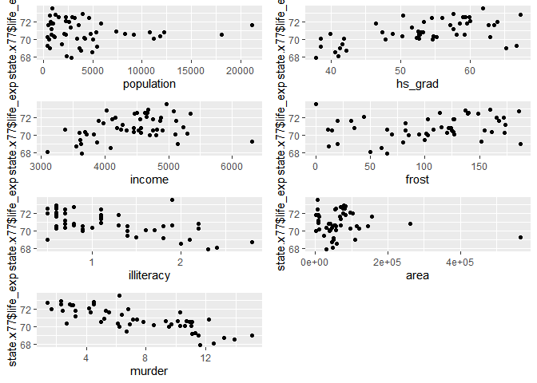<!-- -->

``` r
ggb_p = 
    state.x77 %>% 
    ggplot(aes(y = population))+
    geom_boxplot()+
     labs(y = "population")
  
  
ggb_in = 
    state.x77 %>% 
    ggplot(aes(y = income))+
    geom_boxplot()+
     labs(y = "income")
  
  
ggb_il = 
    state.x77 %>% 
    ggplot(aes(y = illiteracy))+
    geom_boxplot()+
     labs(y = "illiteracy")
  
  
ggb_m = 
    state.x77 %>% 
    ggplot(aes(y = murder))+
    geom_boxplot()+
     labs(y = "murder")
  
  
ggb_h = 
    state.x77 %>% 
    ggplot(aes(y = hs_grad))+
    geom_boxplot()+
     labs(y = "hs_grad")
  
  
ggb_f = 
    state.x77 %>% 
    ggplot(aes(y = frost))+
    geom_boxplot()+
     labs(y = "frost")
  

ggb_a = 
    state.x77 %>% 
    ggplot(aes(y = area))+
    geom_boxplot()+
     labs(y = "area")

ggb_li = 
    state.x77 %>% 
    ggplot(aes(y = life_exp))+
    geom_boxplot()+
     labs(y = "life_exp")


multiplot(ggb_p,ggb_in,ggb_il,
          ggb_m,ggb_h,ggb_f,ggb_a,ggb_li,
          cols=2)  
```

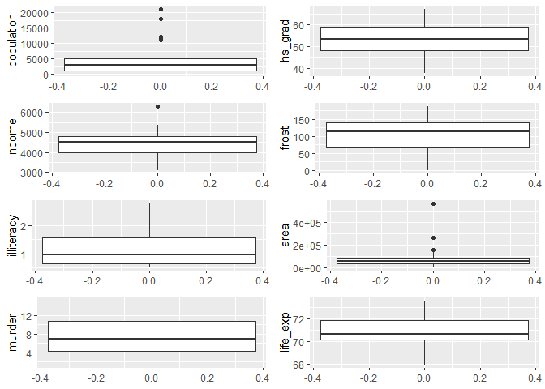<!-- -->

``` r
ggh_p = 
state.x77 %>% 
 ggplot(aes(population,..density..))+
 geom_histogram()+
 geom_line(stat = 'density',size = 1)+
    labs(x = "population")

ggh_in = 
state.x77 %>% 
 ggplot(aes(income,..density..))+
 geom_histogram()+
 geom_line(stat = 'density',size = 1)+
    labs(x = "income")

ggh_il = 
state.x77 %>% 
 ggplot(aes(illiteracy,..density..))+
 geom_histogram()+
 geom_line(stat = 'density',size = 1)+
    labs(x = "illiteracy")

ggh_m = 
state.x77 %>% 
 ggplot(aes(murder,..density..))+
 geom_histogram()+
 geom_line(stat = 'density',size = 1)+
    labs(x = "murder")

ggh_h = 
state.x77 %>% 
 ggplot(aes(hs_grad,..density..))+
 geom_histogram()+
 geom_line(stat = 'density',size = 1)+
    labs(x = "hs_grad")

ggh_f = 
state.x77 %>% 
 ggplot(aes(frost,..density..))+
 geom_histogram()+
 geom_line(stat = 'density',size = 1)+
    labs(x = "frost")

ggh_a = 
state.x77 %>% 
 ggplot(aes(area,..density..))+
 geom_histogram()+
 geom_line(stat = 'density',size = 1)+
    labs(x = "area")

ggh_li = 
state.x77 %>% 
 ggplot(aes(life_exp,..density..))+
 geom_histogram()+
 geom_line(stat = 'density',size = 1)+
    labs(x = "life_exp")

multiplot(ggh_p,ggh_in,ggh_il,
          ggh_m,ggh_h,ggh_f,ggh_a,ggh_li,
          cols=2) 
```

    ## `stat_bin()` using `bins = 30`. Pick better value with `binwidth`.
    ## `stat_bin()` using `bins = 30`. Pick better value with `binwidth`.
    ## `stat_bin()` using `bins = 30`. Pick better value with `binwidth`.
    ## `stat_bin()` using `bins = 30`. Pick better value with `binwidth`.
    ## `stat_bin()` using `bins = 30`. Pick better value with `binwidth`.
    ## `stat_bin()` using `bins = 30`. Pick better value with `binwidth`.
    ## `stat_bin()` using `bins = 30`. Pick better value with `binwidth`.
    ## `stat_bin()` using `bins = 30`. Pick better value with `binwidth`.

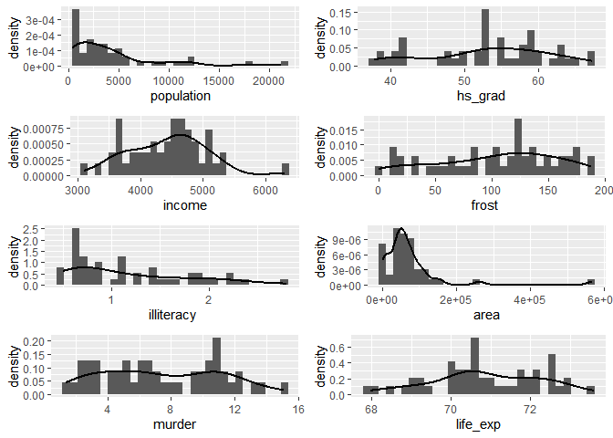<!-- -->

Population and area are skewed

transformation

``` r
ggl_p = 
state.x77 %>% 
  mutate(population = log(population)) %>% 
 ggplot(aes(population,..density..))+
 geom_histogram()+
 geom_line(stat = 'density',size = 1)+
    labs(x = "population")

ggl_a = 
state.x77 %>% 
  mutate(area = log(area)) %>% 
 ggplot(aes(area,..density..))+
 geom_histogram()+
 geom_line(stat = 'density',size = 1)+
    labs(x = "area")


multiplot(ggl_p,ggl_a,
          cols=2) 
```

    ## `stat_bin()` using `bins = 30`. Pick better value with `binwidth`.
    ## `stat_bin()` using `bins = 30`. Pick better value with `binwidth`.

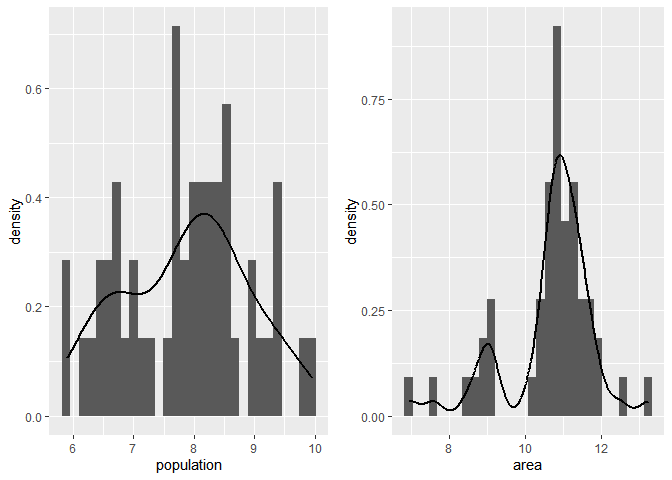<!-- -->

``` r
state_log = 
state.x77 %>% 
  mutate(log_area = log(area),
         log_population = log(population))%>%  
  select(-area,-population)
```

## c)

### i

Correlation between murder and illiteracy is \> 0.7.

backwards

``` r
# Same thing
mult.fit <- lm(life_exp ~ ., data=state_log)
summary(mult.fit)
```

    ## 
    ## Call:
    ## lm(formula = life_exp ~ ., data = state_log)
    ## 
    ## Residuals:
    ##      Min       1Q   Median       3Q      Max 
    ## -1.43084 -0.45559  0.02759  0.49618  1.70215 
    ## 
    ## Coefficients:
    ##                  Estimate Std. Error t value Pr(>|t|)    
    ## (Intercept)     6.795e+01  2.092e+00  32.478  < 2e-16 ***
    ## income          1.396e-05  2.444e-04   0.057   0.9547    
    ## illiteracy      1.126e-01  3.507e-01   0.321   0.7497    
    ## murder         -3.092e-01  4.706e-02  -6.570 6.01e-08 ***
    ## hs_grad         5.278e-02  2.483e-02   2.126   0.0394 *  
    ## frost          -4.869e-03  3.215e-03  -1.515   0.1373    
    ## log_area        6.862e-02  1.098e-01   0.625   0.5354    
    ## log_population  2.527e-01  1.351e-01   1.870   0.0685 .  
    ## ---
    ## Signif. codes:  0 '***' 0.001 '**' 0.01 '*' 0.05 '.' 0.1 ' ' 1
    ## 
    ## Residual standard error: 0.7343 on 42 degrees of freedom
    ## Multiple R-squared:  0.7435, Adjusted R-squared:  0.7008 
    ## F-statistic: 17.39 on 7 and 42 DF,  p-value: 1.433e-10

``` r
step1<-update(mult.fit, . ~ . -income)
summary(step1)
```

    ## 
    ## Call:
    ## lm(formula = life_exp ~ illiteracy + murder + hs_grad + frost + 
    ##     log_area + log_population, data = state_log)
    ## 
    ## Residuals:
    ##      Min       1Q   Median       3Q      Max 
    ## -1.44005 -0.45856  0.02945  0.49580  1.70521 
    ## 
    ## Coefficients:
    ##                 Estimate Std. Error t value Pr(>|t|)    
    ## (Intercept)    67.960656   2.063512  32.934  < 2e-16 ***
    ## illiteracy      0.112615   0.346646   0.325  0.74685    
    ## murder         -0.308609   0.045518  -6.780 2.68e-08 ***
    ## hs_grad         0.053650   0.019378   2.769  0.00828 ** 
    ## frost          -0.004837   0.003127  -1.547  0.12926    
    ## log_area        0.066687   0.103250   0.646  0.52179    
    ## log_population  0.255371   0.125215   2.039  0.04758 *  
    ## ---
    ## Signif. codes:  0 '***' 0.001 '**' 0.01 '*' 0.05 '.' 0.1 ' ' 1
    ## 
    ## Residual standard error: 0.7258 on 43 degrees of freedom
    ## Multiple R-squared:  0.7435, Adjusted R-squared:  0.7077 
    ## F-statistic: 20.77 on 6 and 43 DF,  p-value: 2.978e-11

``` r
# No Alcmod
step2<-update(step1, . ~ . -illiteracy)
summary(step2)
```

    ## 
    ## Call:
    ## lm(formula = life_exp ~ murder + hs_grad + frost + log_area + 
    ##     log_population, data = state_log)
    ## 
    ## Residuals:
    ##      Min       1Q   Median       3Q      Max 
    ## -1.43763 -0.46147  0.00721  0.48073  1.74473 
    ## 
    ## Coefficients:
    ##                 Estimate Std. Error t value Pr(>|t|)    
    ## (Intercept)    68.414712   1.502603  45.531  < 2e-16 ***
    ## murder         -0.301875   0.040110  -7.526 1.95e-09 ***
    ## hs_grad         0.050302   0.016243   3.097   0.0034 ** 
    ## frost          -0.005424   0.002528  -2.146   0.0374 *  
    ## log_area        0.066067   0.102178   0.647   0.5213    
    ## log_population  0.239312   0.113870   2.102   0.0413 *  
    ## ---
    ## Signif. codes:  0 '***' 0.001 '**' 0.01 '*' 0.05 '.' 0.1 ' ' 1
    ## 
    ## Residual standard error: 0.7184 on 44 degrees of freedom
    ## Multiple R-squared:  0.7429, Adjusted R-squared:  0.7136 
    ## F-statistic: 25.42 on 5 and 44 DF,  p-value: 5.833e-12

``` r
# No Age
step3<-update(step2, . ~ . -log_area)
summary(step3)
```

    ## 
    ## Call:
    ## lm(formula = life_exp ~ murder + hs_grad + frost + log_population, 
    ##     data = state_log)
    ## 
    ## Residuals:
    ##      Min       1Q   Median       3Q      Max 
    ## -1.41760 -0.43880  0.02539  0.52066  1.63048 
    ## 
    ## Coefficients:
    ##                 Estimate Std. Error t value Pr(>|t|)    
    ## (Intercept)    68.720810   1.416828  48.503  < 2e-16 ***
    ## murder         -0.290016   0.035440  -8.183 1.87e-10 ***
    ## hs_grad         0.054550   0.014758   3.696 0.000591 ***
    ## frost          -0.005174   0.002482  -2.085 0.042779 *  
    ## log_population  0.246836   0.112539   2.193 0.033491 *  
    ## ---
    ## Signif. codes:  0 '***' 0.001 '**' 0.01 '*' 0.05 '.' 0.1 ' ' 1
    ## 
    ## Residual standard error: 0.7137 on 45 degrees of freedom
    ## Multiple R-squared:  0.7404, Adjusted R-squared:  0.7173 
    ## F-statistic: 32.09 on 4 and 45 DF,  p-value: 1.17e-12

forwards

``` r
### Step 1:  Fit simple linear regressions for all variables,look for the variable with lowest p-value
fit1 <- lm(life_exp ~ income, data=state_log)
tidy(fit1)
```

    ## # A tibble: 2 x 5
    ##   term         estimate std.error statistic  p.value
    ##   <chr>           <dbl>     <dbl>     <dbl>    <dbl>
    ## 1 (Intercept) 67.6       1.33         50.9  1.98e-43
    ## 2 income       0.000743  0.000297      2.51 1.56e- 2

``` r
fit2 <- lm(life_exp ~ illiteracy, data=state_log)
tidy(fit2)
```

    ## # A tibble: 2 x 5
    ##   term        estimate std.error statistic  p.value
    ##   <chr>          <dbl>     <dbl>     <dbl>    <dbl>
    ## 1 (Intercept)    72.4      0.338    214.   3.47e-73
    ## 2 illiteracy     -1.30     0.257     -5.04 6.97e- 6

``` r
fit3 <- lm(life_exp ~ murder, data=state_log)
tidy(fit3)
```

    ## # A tibble: 2 x 5
    ##   term        estimate std.error statistic  p.value
    ##   <chr>          <dbl>     <dbl>     <dbl>    <dbl>
    ## 1 (Intercept)   73.0      0.270     270.   4.72e-78
    ## 2 murder        -0.284    0.0328     -8.66 2.26e-11

``` r
fit4 <- lm(life_exp ~ hs_grad, data=state_log)
tidy(fit4)
```

    ## # A tibble: 2 x 5
    ##   term        estimate std.error statistic  p.value
    ##   <chr>          <dbl>     <dbl>     <dbl>    <dbl>
    ## 1 (Intercept)  65.7       1.05       62.8  9.92e-48
    ## 2 hs_grad       0.0968    0.0195      4.96 9.20e- 6

``` r
fit5 <- lm(life_exp ~ frost, data=state_log)
tidy(fit5)
```

    ## # A tibble: 2 x 5
    ##   term        estimate std.error statistic  p.value
    ##   <chr>          <dbl>     <dbl>     <dbl>    <dbl>
    ## 1 (Intercept) 70.2       0.419      168.   4.33e-68
    ## 2 frost        0.00677   0.00360      1.88 6.60e- 2

``` r
fit6 <- lm(life_exp ~ log_area, data=state_log)
tidy(fit6)
```

    ## # A tibble: 2 x 5
    ##   term        estimate std.error statistic  p.value
    ##   <chr>          <dbl>     <dbl>     <dbl>    <dbl>
    ## 1 (Intercept)   72.2       1.77     40.8   6.18e-39
    ## 2 log_area      -0.125     0.165    -0.757 4.53e- 1

``` r
fit7 <- lm(life_exp ~ log_population, data=state_log)
tidy(fit7)
```

    ## # A tibble: 2 x 5
    ##   term           estimate std.error statistic  p.value
    ##   <chr>             <dbl>     <dbl>     <dbl>    <dbl>
    ## 1 (Intercept)      72.0       1.47     49.1   1.10e-42
    ## 2 log_population   -0.141     0.185    -0.762 4.50e- 1

``` r
forward1<-lm(life_exp~murder, data=state_log)
tidy(forward1)
```

    ## # A tibble: 2 x 5
    ##   term        estimate std.error statistic  p.value
    ##   <chr>          <dbl>     <dbl>     <dbl>    <dbl>
    ## 1 (Intercept)   73.0      0.270     270.   4.72e-78
    ## 2 murder        -0.284    0.0328     -8.66 2.26e-11

``` r
### Step 2: Enter the one with the lowest p-value in the rest 
fit1 <- update(forward1, . ~ . +income)
tidy(fit1)
```

    ## # A tibble: 3 x 5
    ##   term         estimate std.error statistic  p.value
    ##   <chr>           <dbl>     <dbl>     <dbl>    <dbl>
    ## 1 (Intercept) 71.2       0.967        73.6  3.32e-50
    ## 2 murder      -0.270     0.0328       -8.21 1.22e-10
    ## 3 income       0.000370  0.000197      1.88 6.66e- 2

``` r
fit2 <- update(forward1, . ~ . +illiteracy)
tidy(fit2)
```

    ## # A tibble: 3 x 5
    ##   term        estimate std.error statistic  p.value
    ##   <chr>          <dbl>     <dbl>     <dbl>    <dbl>
    ## 1 (Intercept)   73.0      0.286    256.    1.56e-75
    ## 2 murder        -0.264    0.0464    -5.69  7.96e- 7
    ## 3 illiteracy    -0.172    0.281     -0.613 5.43e- 1

``` r
fit3 <- update(forward1, . ~ . +hs_grad)
tidy(fit3)
```

    ## # A tibble: 3 x 5
    ##   term        estimate std.error statistic  p.value
    ##   <chr>          <dbl>     <dbl>     <dbl>    <dbl>
    ## 1 (Intercept)  70.3       1.02       69.2  5.91e-49
    ## 2 murder       -0.237     0.0353     -6.72 2.18e- 8
    ## 3 hs_grad       0.0439    0.0161      2.72 9.09e- 3

``` r
fit4 <- update(forward1, . ~ . +frost)
tidy(fit4)
```

    ## # A tibble: 3 x 5
    ##   term        estimate std.error statistic  p.value
    ##   <chr>          <dbl>     <dbl>     <dbl>    <dbl>
    ## 1 (Intercept) 73.9       0.500      148.   2.36e-64
    ## 2 murder      -0.328     0.0375      -8.74 2.05e-11
    ## 3 frost       -0.00578   0.00266     -2.17 3.52e- 2

``` r
fit5 <- update(forward1, . ~ . +log_area)
tidy(fit5)
```

    ## # A tibble: 3 x 5
    ##   term        estimate std.error statistic  p.value
    ##   <chr>          <dbl>     <dbl>     <dbl>    <dbl>
    ## 1 (Intercept)   71.4      1.10       64.8  1.29e-47
    ## 2 murder        -0.298    0.0340     -8.79 1.73e-11
    ## 3 log_area       0.155    0.107       1.44 1.56e- 1

``` r
fit6 <- update(forward1, . ~ . +log_population)
tidy(fit6)
```

    ## # A tibble: 3 x 5
    ##   term           estimate std.error statistic  p.value
    ##   <chr>             <dbl>     <dbl>     <dbl>    <dbl>
    ## 1 (Intercept)      71.2      0.895      79.5  9.04e-52
    ## 2 murder           -0.310    0.0339     -9.13 5.64e-12
    ## 3 log_population    0.254    0.120       2.11 4.01e- 2

``` r
# Enter the one with the lowest p-value: Progindex
forward2 <- update(forward1, . ~ . + hs_grad)
tidy(forward2)
```

    ## # A tibble: 3 x 5
    ##   term        estimate std.error statistic  p.value
    ##   <chr>          <dbl>     <dbl>     <dbl>    <dbl>
    ## 1 (Intercept)  70.3       1.02       69.2  5.91e-49
    ## 2 murder       -0.237     0.0353     -6.72 2.18e- 8
    ## 3 hs_grad       0.0439    0.0161      2.72 9.09e- 3

``` r
### Step 3: Enter the one with the lowest p-value in the rest 
fit1 <- update(forward2, . ~ . +income)
tidy(fit1)
```

    ## # A tibble: 4 x 5
    ##   term          estimate std.error statistic  p.value
    ##   <chr>            <dbl>     <dbl>     <dbl>    <dbl>
    ## 1 (Intercept) 70.1        1.10        64.0   1.33e-46
    ## 2 murder      -0.239      0.0358      -6.66  2.92e- 8
    ## 3 hs_grad      0.0391     0.0203       1.92  6.05e- 2
    ## 4 income       0.0000953  0.000239     0.398 6.92e- 1

``` r
fit2 <- update(forward2, . ~ . +illiteracy)
tidy(fit2)
```

    ## # A tibble: 4 x 5
    ##   term        estimate std.error statistic  p.value
    ##   <chr>          <dbl>     <dbl>     <dbl>    <dbl>
    ## 1 (Intercept)  69.7       1.22      57.1   2.41e-44
    ## 2 murder       -0.258     0.0435    -5.93  3.63e- 7
    ## 3 hs_grad       0.0518    0.0188     2.76  8.25e- 3
    ## 4 illiteracy    0.254     0.305      0.833 4.09e- 1

``` r
fit3 <- update(forward2, . ~ . +frost)
tidy(fit3)
```

    ## # A tibble: 4 x 5
    ##   term        estimate std.error statistic  p.value
    ##   <chr>          <dbl>     <dbl>     <dbl>    <dbl>
    ## 1 (Intercept) 71.0       0.983       72.2  5.25e-49
    ## 2 murder      -0.283     0.0367      -7.71 8.04e-10
    ## 3 hs_grad      0.0499    0.0152       3.29 1.95e- 3
    ## 4 frost       -0.00691   0.00245     -2.82 6.99e- 3

``` r
fit4 <- update(forward2, . ~ . +log_area)
tidy(fit4)
```

    ## # A tibble: 4 x 5
    ##   term        estimate std.error statistic  p.value
    ##   <chr>          <dbl>     <dbl>     <dbl>    <dbl>
    ## 1 (Intercept)  70.0       1.23      57.0   2.59e-44
    ## 2 murder       -0.245     0.0400    -6.12  1.91e- 7
    ## 3 hs_grad       0.0407    0.0178     2.28  2.72e- 2
    ## 4 log_area      0.0494    0.113      0.438 6.63e- 1

``` r
fit5 <- update(forward2, . ~ . +log_population)
tidy(fit5)
```

    ## # A tibble: 4 x 5
    ##   term           estimate std.error statistic  p.value
    ##   <chr>             <dbl>     <dbl>     <dbl>    <dbl>
    ## 1 (Intercept)     67.5       1.34       50.4  6.97e-42
    ## 2 murder          -0.261     0.0338     -7.73 7.48e-10
    ## 3 hs_grad          0.0519    0.0152      3.41 1.38e- 3
    ## 4 log_population   0.322     0.110       2.91 5.52e- 3

``` r
# Enter the one with the lowest p-value: Alcheav
forward3 <- update(forward2, . ~ . + log_population)
tidy(forward3)
```

    ## # A tibble: 4 x 5
    ##   term           estimate std.error statistic  p.value
    ##   <chr>             <dbl>     <dbl>     <dbl>    <dbl>
    ## 1 (Intercept)     67.5       1.34       50.4  6.97e-42
    ## 2 murder          -0.261     0.0338     -7.73 7.48e-10
    ## 3 hs_grad          0.0519    0.0152      3.41 1.38e- 3
    ## 4 log_population   0.322     0.110       2.91 5.52e- 3

``` r
### Step 4: Enter the one with the lowest p-value in the rest 
fit1 <- update(forward3, . ~ . +income)
tidy(fit1)
```

    ## # A tibble: 5 x 5
    ##   term            estimate std.error statistic  p.value
    ##   <chr>              <dbl>     <dbl>     <dbl>    <dbl>
    ## 1 (Intercept)    67.6       1.35        49.9   4.98e-41
    ## 2 murder         -0.261     0.0341      -7.64  1.15e- 9
    ## 3 hs_grad         0.0577    0.0199       2.90  5.79e- 3
    ## 4 log_population  0.338     0.117        2.89  5.87e- 3
    ## 5 income         -0.000107  0.000233    -0.461 6.47e- 1

``` r
fit2 <- update(forward3, . ~ . +illiteracy)
tidy(fit2)
```

    ## # A tibble: 5 x 5
    ##   term           estimate std.error statistic  p.value
    ##   <chr>             <dbl>     <dbl>     <dbl>    <dbl>
    ## 1 (Intercept)     66.4       1.54       43.0  3.47e-38
    ## 2 murder          -0.297     0.0417     -7.13 6.60e- 9
    ## 3 hs_grad          0.0653    0.0177      3.69 6.05e- 4
    ## 4 log_population   0.349     0.111       3.15 2.89e- 3
    ## 5 illiteracy       0.408     0.283       1.44 1.57e- 1

``` r
fit3 <- update(forward3, . ~ . +frost)
tidy(fit3)
```

    ## # A tibble: 5 x 5
    ##   term           estimate std.error statistic  p.value
    ##   <chr>             <dbl>     <dbl>     <dbl>    <dbl>
    ## 1 (Intercept)    68.7       1.42        48.5  1.70e-40
    ## 2 murder         -0.290     0.0354      -8.18 1.87e-10
    ## 3 hs_grad         0.0546    0.0148       3.70 5.91e- 4
    ## 4 log_population  0.247     0.113        2.19 3.35e- 2
    ## 5 frost          -0.00517   0.00248     -2.08 4.28e- 2

``` r
fit4 <- update(forward3, . ~ . +log_area)
tidy(fit4)
```

    ## # A tibble: 5 x 5
    ##   term           estimate std.error statistic  p.value
    ##   <chr>             <dbl>     <dbl>     <dbl>    <dbl>
    ## 1 (Intercept)     67.3       1.47      45.7   2.28e-39
    ## 2 murder          -0.266     0.0380    -7.01  9.70e- 9
    ## 3 hs_grad          0.0497    0.0169     2.95  5.09e- 3
    ## 4 log_population   0.320     0.112      2.86  6.37e- 3
    ## 5 log_area         0.0326    0.105      0.311 7.57e- 1

``` r
# Enter the one with the lowest p-value: Bloodclot
forward4 <- update(forward3, . ~ . + frost)
tidy(forward4)
```

    ## # A tibble: 5 x 5
    ##   term           estimate std.error statistic  p.value
    ##   <chr>             <dbl>     <dbl>     <dbl>    <dbl>
    ## 1 (Intercept)    68.7       1.42        48.5  1.70e-40
    ## 2 murder         -0.290     0.0354      -8.18 1.87e-10
    ## 3 hs_grad         0.0546    0.0148       3.70 5.91e- 4
    ## 4 log_population  0.247     0.113        2.19 3.35e- 2
    ## 5 frost          -0.00517   0.00248     -2.08 4.28e- 2

``` r
### Step 5: Enter the one with the lowest p-value in the rest 
fit1 <- update(forward4, . ~ . +income)
tidy(fit1)
```

    ## # A tibble: 6 x 5
    ##   term             estimate std.error statistic  p.value
    ##   <chr>               <dbl>     <dbl>     <dbl>    <dbl>
    ## 1 (Intercept)    68.7        1.43        48.0   1.25e-39
    ## 2 murder         -0.290      0.0360      -8.05  3.47e-10
    ## 3 hs_grad         0.0563     0.0193       2.92  5.52e- 3
    ## 4 log_population  0.253      0.121        2.09  4.22e- 2
    ## 5 frost          -0.00512    0.00254     -2.01  5.04e- 2
    ## 6 income         -0.0000327  0.000228    -0.143 8.87e- 1

``` r
fit2 <- update(forward4, . ~ . +illiteracy)
tidy(fit2)
```

    ## # A tibble: 6 x 5
    ##   term           estimate std.error statistic  p.value
    ##   <chr>             <dbl>     <dbl>     <dbl>    <dbl>
    ## 1 (Intercept)    68.3       1.99       34.4   2.03e-33
    ## 2 murder         -0.296     0.0411     -7.21  5.70e- 9
    ## 3 hs_grad         0.0578    0.0182      3.18  2.66e- 3
    ## 4 log_population  0.262     0.124       2.12  3.99e- 2
    ## 5 frost          -0.00461   0.00309    -1.49  1.43e- 1
    ## 6 illiteracy      0.108     0.344       0.315 7.54e- 1

``` r
fit3 <- update(forward4, . ~ . +log_area)
tidy(fit3)
```

    ## # A tibble: 6 x 5
    ##   term           estimate std.error statistic  p.value
    ##   <chr>             <dbl>     <dbl>     <dbl>    <dbl>
    ## 1 (Intercept)    68.4       1.50       45.5   1.18e-38
    ## 2 murder         -0.302     0.0401     -7.53  1.95e- 9
    ## 3 hs_grad         0.0503    0.0162      3.10  3.40e- 3
    ## 4 log_population  0.239     0.114       2.10  4.13e- 2
    ## 5 frost          -0.00542   0.00253    -2.15  3.74e- 2
    ## 6 log_area        0.0661    0.102       0.647 5.21e- 1

``` r
# The model we obtained is Lnsurvival ~ Enzyme + Progindex + Alcheav + Bloodclot
for.fit <- lm(life_exp ~ murder + hs_grad + log_population + frost,state_log)
summary(for.fit)
```

    ## 
    ## Call:
    ## lm(formula = life_exp ~ murder + hs_grad + log_population + frost, 
    ##     data = state_log)
    ## 
    ## Residuals:
    ##      Min       1Q   Median       3Q      Max 
    ## -1.41760 -0.43880  0.02539  0.52066  1.63048 
    ## 
    ## Coefficients:
    ##                 Estimate Std. Error t value Pr(>|t|)    
    ## (Intercept)    68.720810   1.416828  48.503  < 2e-16 ***
    ## murder         -0.290016   0.035440  -8.183 1.87e-10 ***
    ## hs_grad         0.054550   0.014758   3.696 0.000591 ***
    ## log_population  0.246836   0.112539   2.193 0.033491 *  
    ## frost          -0.005174   0.002482  -2.085 0.042779 *  
    ## ---
    ## Signif. codes:  0 '***' 0.001 '**' 0.01 '*' 0.05 '.' 0.1 ' ' 1
    ## 
    ## Residual standard error: 0.7137 on 45 degrees of freedom
    ## Multiple R-squared:  0.7404, Adjusted R-squared:  0.7173 
    ## F-statistic: 32.09 on 4 and 45 DF,  p-value: 1.17e-12

stepwise

``` r
mult.fit <- lm(life_exp ~ ., data=state_log)
step(mult.fit, direction='backward')
```

    ## Start:  AIC=-23.6
    ## life_exp ~ income + illiteracy + murder + hs_grad + frost + log_area + 
    ##     log_population
    ## 
    ##                  Df Sum of Sq    RSS      AIC
    ## - income          1    0.0018 22.650 -25.5934
    ## - illiteracy      1    0.0556 22.704 -25.4746
    ## - log_area        1    0.2106 22.859 -25.1344
    ## <none>                        22.648 -23.5973
    ## - frost           1    1.2374 23.886 -22.9374
    ## - log_population  1    1.8854 24.533 -21.5992
    ## - hs_grad         1    2.4375 25.086 -20.4864
    ## - murder          1   23.2760 45.924   9.7483
    ## 
    ## Step:  AIC=-25.59
    ## life_exp ~ illiteracy + murder + hs_grad + frost + log_area + 
    ##     log_population
    ## 
    ##                  Df Sum of Sq    RSS      AIC
    ## - illiteracy      1    0.0556 22.705 -27.4708
    ## - log_area        1    0.2197 22.870 -27.1107
    ## <none>                        22.650 -25.5934
    ## - frost           1    1.2602 23.910 -24.8862
    ## - log_population  1    2.1909 24.841 -22.9768
    ## - hs_grad         1    4.0374 26.687 -19.3918
    ## - murder          1   24.2130 46.863   8.7601
    ## 
    ## Step:  AIC=-27.47
    ## life_exp ~ murder + hs_grad + frost + log_area + log_population
    ## 
    ##                  Df Sum of Sq    RSS     AIC
    ## - log_area        1    0.2157 22.921 -28.998
    ## <none>                        22.705 -27.471
    ## - log_population  1    2.2792 24.985 -24.688
    ## - frost           1    2.3760 25.082 -24.495
    ## - hs_grad         1    4.9491 27.655 -19.612
    ## - murder          1   29.2296 51.935  11.899
    ## 
    ## Step:  AIC=-29
    ## life_exp ~ murder + hs_grad + frost + log_population
    ## 
    ##                  Df Sum of Sq    RSS     AIC
    ## <none>                        22.921 -28.998
    ## - frost           1     2.214 25.135 -26.387
    ## - log_population  1     2.450 25.372 -25.920
    ## - hs_grad         1     6.959 29.881 -17.741
    ## - murder          1    34.109 57.031  14.578

    ## 
    ## Call:
    ## lm(formula = life_exp ~ murder + hs_grad + frost + log_population, 
    ##     data = state_log)
    ## 
    ## Coefficients:
    ##    (Intercept)          murder         hs_grad           frost  
    ##      68.720810       -0.290016        0.054550       -0.005174  
    ## log_population  
    ##       0.246836

Yes, they generate the same model

### ii

`frost` is 0.042779, slightly less than 0.05, I decided to keep it since
according to all of the three models, they all contain the `frost`.
Furthermore, the `AIC` is the smallest when select the `frost` into the
model.

### iii

``` r
cor(state_log)
```

    ##                      income   illiteracy   life_exp     murder    hs_grad
    ## income          1.000000000 -0.437075186  0.3402553 -0.2300776  0.6199323
    ## illiteracy     -0.437075186  1.000000000 -0.5884779  0.7029752 -0.6571886
    ## life_exp        0.340255339 -0.588477926  1.0000000 -0.7808458  0.5822162
    ## murder         -0.230077610  0.702975199 -0.7808458  1.0000000 -0.4879710
    ## hs_grad         0.619932323 -0.657188609  0.5822162 -0.4879710  1.0000000
    ## frost           0.226282179 -0.671946968  0.2620680 -0.5388834  0.3667797
    ## log_area       -0.007462068  0.007843033 -0.1086351  0.2963133  0.1967434
    ## log_population  0.034963788  0.216042342 -0.1092630  0.3596542 -0.3221172
    ##                      frost     log_area log_population
    ## income          0.22628218 -0.007462068     0.03496379
    ## illiteracy     -0.67194697  0.007843033     0.21604234
    ## life_exp        0.26206801 -0.108635052    -0.10926301
    ## murder         -0.53888344  0.296313252     0.35965424
    ## hs_grad         0.36677970  0.196743429    -0.32211720
    ## frost           1.00000000 -0.021211992    -0.45809012
    ## log_area       -0.02121199  1.000000000     0.08541473
    ## log_population -0.45809012  0.085414734     1.00000000

The correlation between two is -0.657, so there is some association
between them but not very strong.

## d)

``` r
# Printing the 2 best models of each size, using the Cp criterion:
leaps(x = state_log[,-3], y = state_log[,3], nbest=2, method="Cp")
```

    ## $which
    ##       1     2     3     4     5     6     7
    ## 1 FALSE FALSE  TRUE FALSE FALSE FALSE FALSE
    ## 1 FALSE  TRUE FALSE FALSE FALSE FALSE FALSE
    ## 2 FALSE FALSE  TRUE  TRUE FALSE FALSE FALSE
    ## 2 FALSE FALSE  TRUE FALSE  TRUE FALSE FALSE
    ## 3 FALSE FALSE  TRUE  TRUE FALSE FALSE  TRUE
    ## 3 FALSE FALSE  TRUE  TRUE  TRUE FALSE FALSE
    ## 4 FALSE FALSE  TRUE  TRUE  TRUE FALSE  TRUE
    ## 4 FALSE  TRUE  TRUE  TRUE FALSE FALSE  TRUE
    ## 5 FALSE FALSE  TRUE  TRUE  TRUE  TRUE  TRUE
    ## 5 FALSE  TRUE  TRUE  TRUE  TRUE FALSE  TRUE
    ## 6 FALSE  TRUE  TRUE  TRUE  TRUE  TRUE  TRUE
    ## 6  TRUE FALSE  TRUE  TRUE  TRUE  TRUE  TRUE
    ## 7  TRUE  TRUE  TRUE  TRUE  TRUE  TRUE  TRUE
    ## 
    ## $label
    ## [1] "(Intercept)" "1"           "2"           "3"           "4"          
    ## [6] "5"           "6"           "7"          
    ## 
    ## $size
    ##  [1] 2 2 3 3 4 4 5 5 6 6 7 7 8
    ## 
    ## $Cp
    ##  [1] 17.907063 61.040217 11.207857 14.094038  4.612501  5.050598  2.506440
    ##  [8]  4.558615  4.106358  4.410760  6.003263  6.103156  8.000000

``` r
# Printing the 2 best models of each size, using the adjusted R^2 criterion:
leaps(x = state_log[,-3], y = state_log[,3], nbest=2, method="adjr2")
```

    ## $which
    ##       1     2     3     4     5     6     7
    ## 1 FALSE FALSE  TRUE FALSE FALSE FALSE FALSE
    ## 1 FALSE  TRUE FALSE FALSE FALSE FALSE FALSE
    ## 2 FALSE FALSE  TRUE  TRUE FALSE FALSE FALSE
    ## 2 FALSE FALSE  TRUE FALSE  TRUE FALSE FALSE
    ## 3 FALSE FALSE  TRUE  TRUE FALSE FALSE  TRUE
    ## 3 FALSE FALSE  TRUE  TRUE  TRUE FALSE FALSE
    ## 4 FALSE FALSE  TRUE  TRUE  TRUE FALSE  TRUE
    ## 4 FALSE  TRUE  TRUE  TRUE FALSE FALSE  TRUE
    ## 5 FALSE FALSE  TRUE  TRUE  TRUE  TRUE  TRUE
    ## 5 FALSE  TRUE  TRUE  TRUE  TRUE FALSE  TRUE
    ## 6 FALSE  TRUE  TRUE  TRUE  TRUE  TRUE  TRUE
    ## 6  TRUE FALSE  TRUE  TRUE  TRUE  TRUE  TRUE
    ## 7  TRUE  TRUE  TRUE  TRUE  TRUE  TRUE  TRUE
    ## 
    ## $label
    ## [1] "(Intercept)" "1"           "2"           "3"           "4"          
    ## [6] "5"           "6"           "7"          
    ## 
    ## $size
    ##  [1] 2 2 3 3 4 4 5 5 6 6 7 7 8
    ## 
    ## $adjr2
    ##  [1] 0.6015893 0.3326876 0.6484991 0.6301232 0.6967729 0.6939230 0.7173392
    ##  [8] 0.7036925 0.7136360 0.7115658 0.7076938 0.7069987 0.7007574

``` r
# Summary of models for each size (one model per size)
# Function regsubsets() performs a subset slection by identifying the "best" model that contains
# a certain number of predictors. By default "best" is chosen using SSE/RSS (smaller is better).


b<-regsubsets(life_exp ~ ., data=state_log)
   (rs<-summary(b))
```

    ## Subset selection object
    ## Call: regsubsets.formula(life_exp ~ ., data = state_log)
    ## 7 Variables  (and intercept)
    ##                Forced in Forced out
    ## income             FALSE      FALSE
    ## illiteracy         FALSE      FALSE
    ## murder             FALSE      FALSE
    ## hs_grad            FALSE      FALSE
    ## frost              FALSE      FALSE
    ## log_area           FALSE      FALSE
    ## log_population     FALSE      FALSE
    ## 1 subsets of each size up to 7
    ## Selection Algorithm: exhaustive
    ##          income illiteracy murder hs_grad frost log_area log_population
    ## 1  ( 1 ) " "    " "        "*"    " "     " "   " "      " "           
    ## 2  ( 1 ) " "    " "        "*"    "*"     " "   " "      " "           
    ## 3  ( 1 ) " "    " "        "*"    "*"     " "   " "      "*"           
    ## 4  ( 1 ) " "    " "        "*"    "*"     "*"   " "      "*"           
    ## 5  ( 1 ) " "    " "        "*"    "*"     "*"   "*"      "*"           
    ## 6  ( 1 ) " "    "*"        "*"    "*"     "*"   "*"      "*"           
    ## 7  ( 1 ) "*"    "*"        "*"    "*"     "*"   "*"      "*"

``` r
# This function also returns R2, Cp, BIC for each "best" model.
# Let's take a look at these values.

# Plots of Cp and Adj-R2 as functions of parameters

par(mar=c(4,4,1,1))
par(mfrow=c(1,2))

plot(2:8, rs$cp, xlab="No of parameters", ylab="Cp Statistic")
abline(0,1)

plot(2:8, rs$adjr2, xlab="No of parameters", ylab="Adj R2")
```

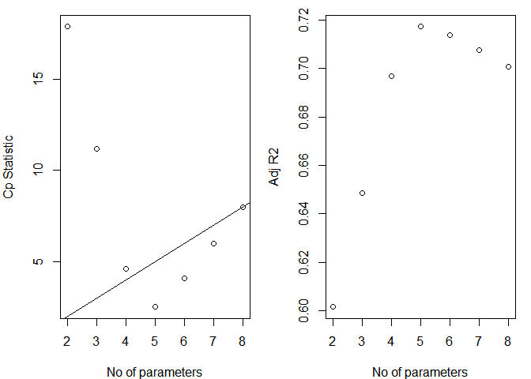<!-- -->

When the number of parameter is equal to 5, the largest Radj and
smallest cp.

When the number of parameter is equal to 4, similar cp = number of
parameters.

When the number of parameter is equal to 3, the most similar cp = number
of parameters.

``` r
# AIC of the 3-predictor model:

aic.fit3 <- lm(life_exp ~ murder + hs_grad + log_population,state_log )
summary(aic.fit3)
```

    ## 
    ## Call:
    ## lm(formula = life_exp ~ murder + hs_grad + log_population, data = state_log)
    ## 
    ## Residuals:
    ##      Min       1Q   Median       3Q      Max 
    ## -1.50380 -0.59250  0.06207  0.42032  2.31066 
    ## 
    ## Coefficients:
    ##                Estimate Std. Error t value Pr(>|t|)    
    ## (Intercept)    67.52120    1.34101  50.351  < 2e-16 ***
    ## murder         -0.26121    0.03380  -7.727 7.48e-10 ***
    ## hs_grad         0.05187    0.01523   3.406  0.00138 ** 
    ## log_population  0.32172    0.11046   2.912  0.00552 ** 
    ## ---
    ## Signif. codes:  0 '***' 0.001 '**' 0.01 '*' 0.05 '.' 0.1 ' ' 1
    ## 
    ## Residual standard error: 0.7392 on 46 degrees of freedom
    ## Multiple R-squared:  0.7153, Adjusted R-squared:  0.6968 
    ## F-statistic: 38.53 on 3 and 46 DF,  p-value: 1.32e-12

``` r
AIC(aic.fit3)
```

    ## [1] 117.5065

``` r
aic.fit4 <- lm(life_exp ~ murder + hs_grad + log_population + frost ,state_log )
summary(aic.fit4)
```

    ## 
    ## Call:
    ## lm(formula = life_exp ~ murder + hs_grad + log_population + frost, 
    ##     data = state_log)
    ## 
    ## Residuals:
    ##      Min       1Q   Median       3Q      Max 
    ## -1.41760 -0.43880  0.02539  0.52066  1.63048 
    ## 
    ## Coefficients:
    ##                 Estimate Std. Error t value Pr(>|t|)    
    ## (Intercept)    68.720810   1.416828  48.503  < 2e-16 ***
    ## murder         -0.290016   0.035440  -8.183 1.87e-10 ***
    ## hs_grad         0.054550   0.014758   3.696 0.000591 ***
    ## log_population  0.246836   0.112539   2.193 0.033491 *  
    ## frost          -0.005174   0.002482  -2.085 0.042779 *  
    ## ---
    ## Signif. codes:  0 '***' 0.001 '**' 0.01 '*' 0.05 '.' 0.1 ' ' 1
    ## 
    ## Residual standard error: 0.7137 on 45 degrees of freedom
    ## Multiple R-squared:  0.7404, Adjusted R-squared:  0.7173 
    ## F-statistic: 32.09 on 4 and 45 DF,  p-value: 1.17e-12

``` r
AIC(aic.fit4)
```

    ## [1] 114.8959

``` r
aic.fit5 <- lm(life_exp ~ murder + hs_grad + log_population + frost +log_area ,state_log )
summary(aic.fit5)
```

    ## 
    ## Call:
    ## lm(formula = life_exp ~ murder + hs_grad + log_population + frost + 
    ##     log_area, data = state_log)
    ## 
    ## Residuals:
    ##      Min       1Q   Median       3Q      Max 
    ## -1.43763 -0.46147  0.00721  0.48073  1.74473 
    ## 
    ## Coefficients:
    ##                 Estimate Std. Error t value Pr(>|t|)    
    ## (Intercept)    68.414712   1.502603  45.531  < 2e-16 ***
    ## murder         -0.301875   0.040110  -7.526 1.95e-09 ***
    ## hs_grad         0.050302   0.016243   3.097   0.0034 ** 
    ## log_population  0.239312   0.113870   2.102   0.0413 *  
    ## frost          -0.005424   0.002528  -2.146   0.0374 *  
    ## log_area        0.066067   0.102178   0.647   0.5213    
    ## ---
    ## Signif. codes:  0 '***' 0.001 '**' 0.01 '*' 0.05 '.' 0.1 ' ' 1
    ## 
    ## Residual standard error: 0.7184 on 44 degrees of freedom
    ## Multiple R-squared:  0.7429, Adjusted R-squared:  0.7136 
    ## F-statistic: 25.42 on 5 and 44 DF,  p-value: 5.833e-12

``` r
AIC(aic.fit5)
```

    ## [1] 116.423

When 4 predictors, the AIC is the smallest. So choose model with 4
predictors.

murder + hs\_grad + log\_population + frost

## e)

### i

3)  and d) get te same model.

<!-- end list -->

``` r
influence.measures(aic.fit4) 
```

    ## Influence measures of
    ##   lm(formula = life_exp ~ murder + hs_grad + log_population + frost,      data = state_log) :
    ## 
    ##                   dfb.1_  dfb.mrdr  dfb.hs_g  dfb.lg_p dfb.frst    dffit
    ## Alabama         0.093164  1.54e-01 -0.065645 -0.095658 -0.09185  0.31415
    ## Alaska          0.082181 -3.25e-01 -0.245469  0.197451 -0.09938 -0.43712
    ## Arizona        -0.111760  9.09e-02 -0.197686  0.165137  0.47189 -0.54168
    ## Arkansas        0.405014 -2.09e-02 -0.391545 -0.229081 -0.12787  0.54428
    ## California     -0.113683  2.57e-02  0.117306  0.092384 -0.05448  0.17194
    ## Colorado       -0.253202  1.56e-01  0.226235  0.115453  0.21261  0.36539
    ## Connecticut    -0.008355 -7.33e-02 -0.010773  0.046640  0.02041  0.11951
    ## Delaware       -0.255420  3.81e-02  0.030851  0.306995  0.14241 -0.36906
    ## Florida        -0.000252  8.87e-05  0.000496  0.000304 -0.00098  0.00153
    ## Georgia        -0.011381 -3.84e-02  0.027384  0.003328 -0.00619 -0.07332
    ## Hawaii          0.619189 -4.06e-01  0.566152 -0.867924 -1.53843  1.74328
    ## Idaho           0.042239 -7.07e-03  0.040647 -0.084505 -0.02273  0.14513
    ## Illinois        0.040766 -2.54e-02 -0.011148 -0.040331 -0.03507 -0.05634
    ## Indiana         0.020006  3.59e-04 -0.000341 -0.029438 -0.02039 -0.04467
    ## Iowa           -0.002542 -1.15e-02  0.001721  0.006678  0.00138  0.01842
    ## Kansas         -0.024034 -6.62e-02  0.070901  0.019021 -0.03484  0.17091
    ## Kentucky        0.179977  4.82e-02 -0.309068 -0.034027  0.09013  0.40026
    ## Louisiana      -0.087740 -5.03e-02  0.055557  0.064083  0.10843 -0.21257
    ## Maine          -0.231935  2.90e-01  0.190679  0.118504 -0.12807 -0.57083
    ## Maryland        0.029818 -2.32e-02 -0.008596 -0.036916 -0.02062 -0.09682
    ## Massachusetts   0.088945  1.98e-01 -0.065584 -0.178215  0.05959 -0.32200
    ## Michigan       -0.238067  1.95e-01  0.081773  0.205843  0.20996  0.33627
    ## Minnesota      -0.068348 -1.26e-01 -0.003045  0.136503  0.09043  0.25074
    ## Mississippi    -0.241655 -1.32e-01  0.206069  0.190293  0.10364 -0.43729
    ## Missouri       -0.028918  4.12e-02 -0.029366  0.053563  0.06005  0.13361
    ## Montana        -0.051619 -1.43e-02 -0.047074  0.128833 -0.06411 -0.27052
    ## Nebraska        0.012590 -7.07e-02  0.015810 -0.003323 -0.00228  0.12965
    ## Nevada          0.187361 -4.27e-01 -0.263770  0.123993 -0.27399 -0.53116
    ## New Hampshire  -0.041228  3.78e-02  0.016411  0.048017 -0.06156 -0.16515
    ## New Jersey      0.084452  1.27e-01  0.034420 -0.205562 -0.05363 -0.28469
    ## New Mexico      0.003840  6.84e-02  0.025462 -0.048751  0.02257  0.10211
    ## New York       -0.046848  2.14e-02  0.019447  0.049608  0.01661  0.06314
    ## North Carolina -0.014411 -5.35e-03  0.032781 -0.004587 -0.00777 -0.04616
    ## North Dakota    0.395237 -3.40e-01 -0.397658 -0.205286  0.18543  0.68500
    ## Ohio            0.086282 -3.83e-03 -0.013070 -0.113939 -0.06479 -0.13488
    ## Oklahoma        0.023677 -2.77e-02 -0.012390 -0.005569 -0.02817  0.05530
    ## Oregon         -0.038771  9.76e-02 -0.053195  0.027664  0.15119 -0.18490
    ## Pennsylvania    0.191811  1.12e-01  0.079926 -0.378227 -0.19146 -0.46026
    ## Rhode Island    0.147326 -1.26e-01 -0.128814 -0.067792 -0.02902  0.18497
    ## South Carolina -0.331641 -7.49e-02  0.394591  0.163742  0.04123 -0.55501
    ## South Dakota    0.062820 -5.91e-02 -0.050707 -0.038415  0.01987  0.11216
    ## Tennessee       0.084329  3.96e-02 -0.134423 -0.011693 -0.00500  0.22505
    ## Texas          -0.132948  1.25e-01  0.033883  0.197414 -0.09183  0.44100
    ## Utah           -0.108486  1.84e-02  0.255592 -0.036620 -0.00818  0.34331
    ## Vermont         0.115480  5.28e-02 -0.008974 -0.204807  0.10503  0.33120
    ## Virginia        0.001017 -6.91e-03  0.011578 -0.012402 -0.00348 -0.04074
    ## Washington      0.023176  3.31e-01 -0.349437 -0.024418  0.57841 -0.75432
    ## West Virginia  -0.332040  1.66e-01  0.359058  0.131277  0.03700 -0.42175
    ## Wisconsin      -0.028050 -8.11e-02 -0.025452  0.085101  0.05038  0.14969
    ## Wyoming        -0.006833 -1.15e-01 -0.089306  0.135985 -0.07840 -0.24759
    ##                cov.r   cook.d    hat inf
    ## Alabama        1.199 1.99e-02 0.1324    
    ## Alaska         1.444 3.86e-02 0.2691   *
    ## Arizona        1.049 5.76e-02 0.1350    
    ## Arkansas       0.893 5.68e-02 0.0920    
    ## California     1.418 6.03e-03 0.2200   *
    ## Colorado       1.081 2.66e-02 0.0981    
    ## Connecticut    1.156 2.91e-03 0.0574    
    ## Delaware       1.006 2.68e-02 0.0757    
    ## Florida        1.242 4.78e-07 0.0989    
    ## Georgia        1.233 1.10e-03 0.0976    
    ## Hawaii         0.645 5.23e-01 0.2683   *
    ## Idaho          1.128 4.27e-03 0.0509    
    ## Illinois       1.258 6.49e-04 0.1131    
    ## Indiana        1.160 4.08e-04 0.0406    
    ## Iowa           1.200 6.94e-05 0.0677    
    ## Kansas         1.081 5.88e-03 0.0412    
    ## Kentucky       1.040 3.17e-02 0.0941    
    ## Louisiana      1.208 9.17e-03 0.1111    
    ## Maine          0.732 6.04e-02 0.0667    
    ## Maryland       1.104 1.90e-03 0.0260    
    ## Massachusetts  1.072 2.07e-02 0.0827    
    ## Michigan       1.134 2.27e-02 0.1101    
    ## Minnesota      1.142 1.27e-02 0.0887    
    ## Mississippi    1.015 3.76e-02 0.0967    
    ## Missouri       1.106 3.61e-03 0.0381    
    ## Montana        1.031 1.46e-02 0.0556    
    ## Nebraska       1.138 3.41e-03 0.0509    
    ## Nevada         1.437 5.68e-02 0.2819   *
    ## New Hampshire  1.148 5.53e-03 0.0666    
    ## New Jersey     1.048 1.61e-02 0.0643    
    ## New Mexico     1.168 2.12e-03 0.0594    
    ## New York       1.257 8.15e-04 0.1129    
    ## North Carolina 1.226 4.36e-04 0.0899    
    ## North Dakota   0.955 9.02e-02 0.1422    
    ## Ohio           1.195 3.70e-03 0.0844    
    ## Oklahoma       1.145 6.24e-04 0.0327    
    ## Oregon         1.247 6.96e-03 0.1264    
    ## Pennsylvania   1.007 4.15e-02 0.1003    
    ## Rhode Island   1.261 6.96e-03 0.1348    
    ## South Carolina 0.930 5.94e-02 0.1037    
    ## South Dakota   1.234 2.57e-03 0.1042    
    ## Tennessee      1.096 1.02e-02 0.0626    
    ## Texas          0.961 3.79e-02 0.0830    
    ## Utah           1.058 2.34e-02 0.0841    
    ## Vermont        1.066 2.18e-02 0.0833    
    ## Virginia       1.152 3.39e-04 0.0337    
    ## Washington     0.987 1.09e-01 0.1682    
    ## West Virginia  1.010 3.50e-02 0.0909    
    ## Wisconsin      1.184 4.56e-03 0.0817    
    ## Wyoming        1.228 1.24e-02 0.1299

There are four influencial points: Alaska, California, Hawaii, Nevada

We need more information about these four stats and we cannot delete
them without any researches.

### ii

``` r
par(mfrow = c(1, 2))
qqnorm(resid(aic.fit4), xlab = "Expected Value", ylab = "Residual", main = "")
qqline(resid(aic.fit4))
title("QQ Plot for Y (Life expendency)")


plot(fitted(aic.fit4), resid(aic.fit4), xlab = "Predicted/Fitted value", ylab = "Residual")
title("Residual Plot for lnY Life expendency)")
abline(0, 0)
```

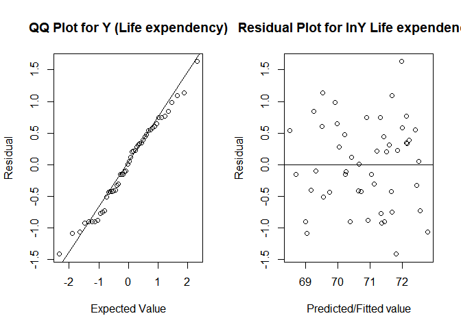<!-- -->

``` r
par(mfrow=c(2,2))
plot(aic.fit4)
```

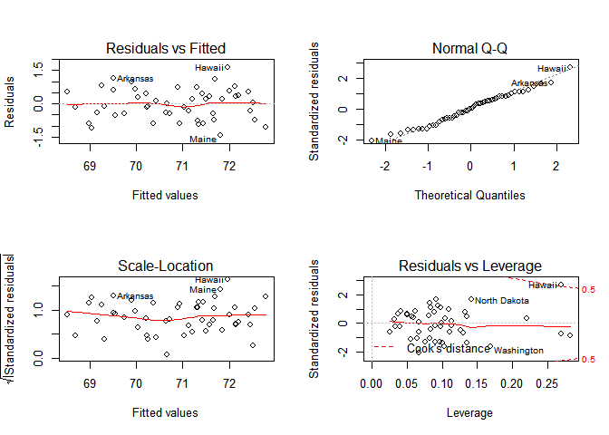<!-- -->

1.  According to the QQ plot, the points are linear, so the residuals
    follow normal distribution.

2.  According to the residual vs fitted values, the points are bounce
    arround y=0, which means they contain constant variance and they are
    independent to each other.

### iii

``` r
# Use 5-fold validation and create the training sets

set.seed(1)
data_train<-trainControl(method="cv", number=10)

# Fit the 4-variables model that we discussed in previous lectures
model_caret<-train(life_exp ~ murder + hs_grad + log_population + frost,
                   data=state_log,
                   trControl=data_train,
                   method='lm',
                   na.action=na.pass)
  
# Model predictions using 4 parts of the data for training 
model_caret
```

    ## Linear Regression 
    ## 
    ## 50 samples
    ##  4 predictor
    ## 
    ## No pre-processing
    ## Resampling: Cross-Validated (10 fold) 
    ## Summary of sample sizes: 45, 45, 45, 43, 46, 46, ... 
    ## Resampling results:
    ## 
    ##   RMSE       Rsquared   MAE      
    ##   0.7617203  0.7674965  0.6665966
    ## 
    ## Tuning parameter 'intercept' was held constant at a value of TRUE

``` r
# Model coefficients
model_caret$finalModel
```

    ## 
    ## Call:
    ## lm(formula = .outcome ~ ., data = dat)
    ## 
    ## Coefficients:
    ##    (Intercept)          murder         hs_grad  log_population  
    ##      68.720810       -0.290016        0.054550        0.246836  
    ##          frost  
    ##      -0.005174

``` r
# Examine model prediction for each fold
model_caret$resample
```

    ##         RMSE  Rsquared       MAE Resample
    ## 1  0.7272280 0.6869238 0.6674696   Fold01
    ## 2  0.4862708 0.8874543 0.4410437   Fold02
    ## 3  0.7590972 0.7790884 0.6884443   Fold03
    ## 4  0.3336417 0.8595139 0.3089362   Fold04
    ## 5  0.5477149 0.8501890 0.4592053   Fold05
    ## 6  1.3014101 0.9750501 1.1120862   Fold06
    ## 7  1.1677214 0.3498620 1.0918029   Fold07
    ## 8  0.9104841 0.5910320 0.6811910   Fold08
    ## 9  0.6442980 0.8436584 0.6033627   Fold09
    ## 10 0.7393366 0.8521929 0.6124238   Fold10

``` r
# Look at standard deviation around the Rsquared value by examining the R-squared from each fold.
sd(model_caret$resample$Rsquared)
```

    ## [1] 0.1819439

``` r
# Let's look at the model using all data, no CV
full_model<-lm(life_exp ~ murder + hs_grad + log_population + frost, data=state_log)
summary(full_model)
```

    ## 
    ## Call:
    ## lm(formula = life_exp ~ murder + hs_grad + log_population + frost, 
    ##     data = state_log)
    ## 
    ## Residuals:
    ##      Min       1Q   Median       3Q      Max 
    ## -1.41760 -0.43880  0.02539  0.52066  1.63048 
    ## 
    ## Coefficients:
    ##                 Estimate Std. Error t value Pr(>|t|)    
    ## (Intercept)    68.720810   1.416828  48.503  < 2e-16 ***
    ## murder         -0.290016   0.035440  -8.183 1.87e-10 ***
    ## hs_grad         0.054550   0.014758   3.696 0.000591 ***
    ## log_population  0.246836   0.112539   2.193 0.033491 *  
    ## frost          -0.005174   0.002482  -2.085 0.042779 *  
    ## ---
    ## Signif. codes:  0 '***' 0.001 '**' 0.01 '*' 0.05 '.' 0.1 ' ' 1
    ## 
    ## Residual standard error: 0.7137 on 45 degrees of freedom
    ## Multiple R-squared:  0.7404, Adjusted R-squared:  0.7173 
    ## F-statistic: 32.09 on 4 and 45 DF,  p-value: 1.17e-12

``` r
# Full data had an Rsquared=0.8299; what was the CV result for R-squared?
# What about MSE values? Values are comparable.
```

The R squared(0.7674965) is higher than the whole model(0.7404).

## f)

R-squared, AIC, Cp

# Porblem 2

``` r
CP = read_csv(".\\data\\CommercialProperties.csv") 
```

    ## Parsed with column specification:
    ## cols(
    ##   Rental_rate = col_double(),
    ##   Age = col_double(),
    ##   Taxes = col_double(),
    ##   Vacancy_rate = col_double(),
    ##   Sq_footage = col_double()
    ## )

## a)

``` r
mult.fit <- lm(Rental_rate ~ ., data=CP)
summary(mult.fit)
```

    ## 
    ## Call:
    ## lm(formula = Rental_rate ~ ., data = CP)
    ## 
    ## Residuals:
    ##     Min      1Q  Median      3Q     Max 
    ## -3.1872 -0.5911 -0.0910  0.5579  2.9441 
    ## 
    ## Coefficients:
    ##                Estimate Std. Error t value Pr(>|t|)    
    ## (Intercept)   1.220e+01  5.780e-01  21.110  < 2e-16 ***
    ## Age          -1.420e-01  2.134e-02  -6.655 3.89e-09 ***
    ## Taxes         2.820e-01  6.317e-02   4.464 2.75e-05 ***
    ## Vacancy_rate  6.193e-01  1.087e+00   0.570     0.57    
    ## Sq_footage    7.924e-06  1.385e-06   5.722 1.98e-07 ***
    ## ---
    ## Signif. codes:  0 '***' 0.001 '**' 0.01 '*' 0.05 '.' 0.1 ' ' 1
    ## 
    ## Residual standard error: 1.137 on 76 degrees of freedom
    ## Multiple R-squared:  0.5847, Adjusted R-squared:  0.5629 
    ## F-statistic: 26.76 on 4 and 76 DF,  p-value: 7.272e-14

Except for the `Vacancy_rate`, all other variables are significant.

The R squared is 0.5629, which means 58.47% of the variance in y
(Rental\_rate) is explained by 4 variables(Age, Taxes, Vacancy\_rate,
Sq\_footage).

## b)

``` r
gg_a = 
    CP %>% 
    ggplot(aes(x = Age, y = Rental_rate))+
    geom_point()+
     labs(x = "Age")
  
  
gg_t = 
    CP %>% 
    ggplot(aes(x = Taxes, y = Rental_rate))+
    geom_point()+
     labs(x = "Taxes")
  
  
gg_s = 
    CP %>% 
    ggplot(aes(x = Sq_footage, y = Rental_rate))+
    geom_point()+
     labs(x = "Sq_footage")
  


multiplot(gg_a,gg_t,gg_s,
          cols=2)  
```

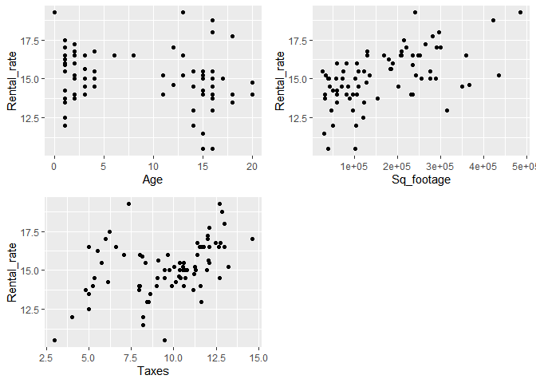<!-- -->

In the plots of `Sq_footage` and `Taxes`, there is a strong relation
between `Sq_footage`, `Taxes` and the outcome(`Rental_rate`),
respectively.

However, as for the Age plot, the points are diveided into two cluster
apparently, and the linear association is not as strong as others.

## c)

``` r
mult.fit <- lm(Rental_rate ~ Age + Taxes + Sq_footage, data=CP)
summary(mult.fit)
```

    ## 
    ## Call:
    ## lm(formula = Rental_rate ~ Age + Taxes + Sq_footage, data = CP)
    ## 
    ## Residuals:
    ##     Min      1Q  Median      3Q     Max 
    ## -3.0620 -0.6437 -0.1013  0.5672  2.9583 
    ## 
    ## Coefficients:
    ##               Estimate Std. Error t value Pr(>|t|)    
    ## (Intercept)  1.237e+01  4.928e-01  25.100  < 2e-16 ***
    ## Age         -1.442e-01  2.092e-02  -6.891 1.33e-09 ***
    ## Taxes        2.672e-01  5.729e-02   4.663 1.29e-05 ***
    ## Sq_footage   8.178e-06  1.305e-06   6.265 1.97e-08 ***
    ## ---
    ## Signif. codes:  0 '***' 0.001 '**' 0.01 '*' 0.05 '.' 0.1 ' ' 1
    ## 
    ## Residual standard error: 1.132 on 77 degrees of freedom
    ## Multiple R-squared:  0.583,  Adjusted R-squared:  0.5667 
    ## F-statistic: 35.88 on 3 and 77 DF,  p-value: 1.295e-14

## d)

### i

``` r
CP_center = 
CP %>% 
  mutate(Age_center = Age - mean(Age)) 
mult.fit <- lm(Rental_rate ~ Age + Taxes + Sq_footage + I(Age_center^2), data=CP_center)
summary(mult.fit)
```

    ## 
    ## Call:
    ## lm(formula = Rental_rate ~ Age + Taxes + Sq_footage + I(Age_center^2), 
    ##     data = CP_center)
    ## 
    ## Residuals:
    ##      Min       1Q   Median       3Q      Max 
    ## -2.89596 -0.62547 -0.08907  0.62793  2.68309 
    ## 
    ## Coefficients:
    ##                   Estimate Std. Error t value Pr(>|t|)    
    ## (Intercept)      1.162e+01  5.692e-01  20.412  < 2e-16 ***
    ## Age             -1.818e-01  2.551e-02  -7.125 5.10e-10 ***
    ## Taxes            3.140e-01  5.880e-02   5.340 9.33e-07 ***
    ## Sq_footage       8.046e-06  1.267e-06   6.351 1.42e-08 ***
    ## I(Age_center^2)  1.415e-02  5.821e-03   2.431   0.0174 *  
    ## ---
    ## Signif. codes:  0 '***' 0.001 '**' 0.01 '*' 0.05 '.' 0.1 ' ' 1
    ## 
    ## Residual standard error: 1.097 on 76 degrees of freedom
    ## Multiple R-squared:  0.6131, Adjusted R-squared:  0.5927 
    ## F-statistic:  30.1 on 4 and 76 DF,  p-value: 5.203e-15

``` r
mutate(CP_center, fitted = fitted(mult.fit)) %>%
  ggplot(., aes(y=Rental_rate, x=Age)) + geom_point() + 
  geom_line(aes(y = fitted), color = "red") + theme_bw()
```

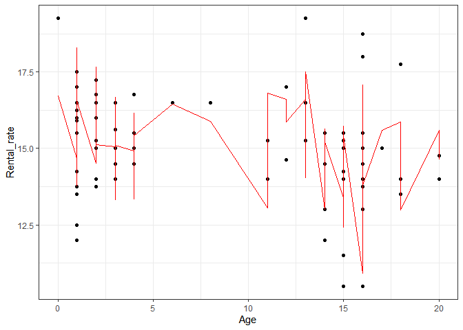<!-- -->

The points from Age vs Rental\_rate is not quadratic, so the higher
order may not suitable, though the second order Age is significant.

We should centered Age, since it can avoid the correlation between first
and second order of Age variable.

### ii

``` r
CP$Ageest <- ifelse(CP$Age<8, 0, CP$Age-8)
#check<- cbind(data_hosp$NURSE,data_hosp$NURSEstar)

reg_spline<-lm(Rental_rate ~ Age + Taxes + Sq_footage + Ageest, data=CP)
summary(reg_spline)
```

    ## 
    ## Call:
    ## lm(formula = Rental_rate ~ Age + Taxes + Sq_footage + Ageest, 
    ##     data = CP)
    ## 
    ## Residuals:
    ##     Min      1Q  Median      3Q     Max 
    ## -2.9729 -0.6581 -0.1064  0.6959  2.6103 
    ## 
    ## Coefficients:
    ##               Estimate Std. Error t value Pr(>|t|)    
    ## (Intercept)  1.242e+01  4.807e-01  25.835  < 2e-16 ***
    ## Age         -3.448e-01  9.114e-02  -3.783 0.000307 ***
    ## Taxes        3.166e-01  5.996e-02   5.280 1.19e-06 ***
    ## Sq_footage   8.092e-06  1.273e-06   6.359 1.38e-08 ***
    ## Ageest       3.447e-01  1.526e-01   2.258 0.026813 *  
    ## ---
    ## Signif. codes:  0 '***' 0.001 '**' 0.01 '*' 0.05 '.' 0.1 ' ' 1
    ## 
    ## Residual standard error: 1.103 on 76 degrees of freedom
    ## Multiple R-squared:  0.6092, Adjusted R-squared:  0.5886 
    ## F-statistic: 29.62 on 4 and 76 DF,  p-value: 7.541e-15

``` r
mutate(CP, fitted = fitted(reg_spline)) %>%
  ggplot(., aes(y=Rental_rate, x=Age)) + geom_point() + 
  geom_line(aes(y = fitted), color = "red") + theme_bw()
```

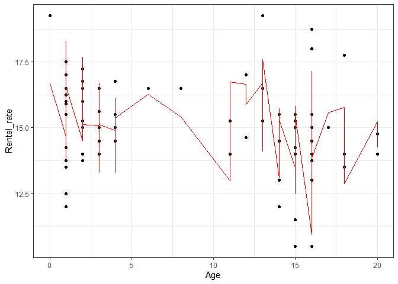<!-- -->

``` r
reg_spline1<-lm(Rental_rate ~ Age + Ageest, data=CP)
summary(reg_spline1)
```

    ## 
    ## Call:
    ## lm(formula = Rental_rate ~ Age + Ageest, data = CP)
    ## 
    ## Residuals:
    ##     Min      1Q  Median      3Q     Max 
    ## -4.1846 -0.9880  0.1370  0.9881  4.3529 
    ## 
    ## Coefficients:
    ##             Estimate Std. Error t value Pr(>|t|)    
    ## (Intercept) 15.52384    0.40850  38.002   <2e-16 ***
    ## Age         -0.01193    0.12430  -0.096    0.924    
    ## Ageest      -0.09432    0.21554  -0.438    0.663    
    ## ---
    ## Signif. codes:  0 '***' 0.001 '**' 0.01 '*' 0.05 '.' 0.1 ' ' 1
    ## 
    ## Residual standard error: 1.684 on 78 degrees of freedom
    ## Multiple R-squared:  0.06494,    Adjusted R-squared:  0.04096 
    ## F-statistic: 2.708 on 2 and 78 DF,  p-value: 0.07291

``` r
mutate(CP, fitted = fitted(reg_spline1)) %>%
  ggplot(., aes(y=Rental_rate, x=Age)) + geom_point() + 
  geom_line(aes(y = fitted), color = "red") + theme_bw()
```

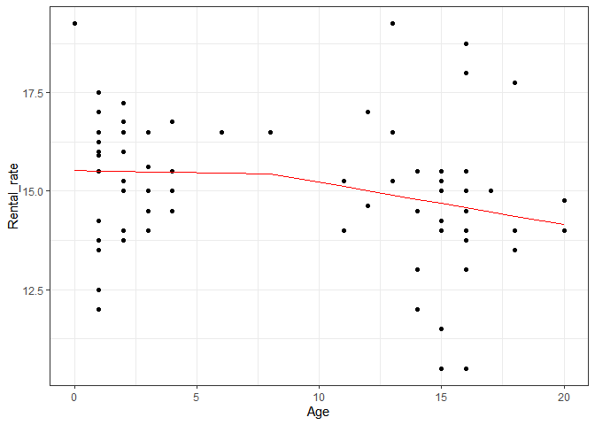<!-- -->

According to the scatter plot, I split the points with Age = 8, since
there are clearly two clusters in the plot.

### iii

The adj\_R squared and SE are similar between two models, I recommend to
use picewise, since it is easier to interpret

## e)

``` r
par(mfrow=c(2,2))
plot(reg_spline)
```

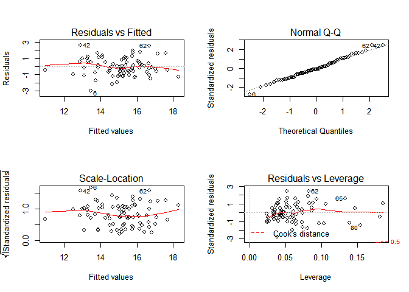<!-- -->

``` r
par(mfrow=c(2,2))
plot(mult.fit)
```

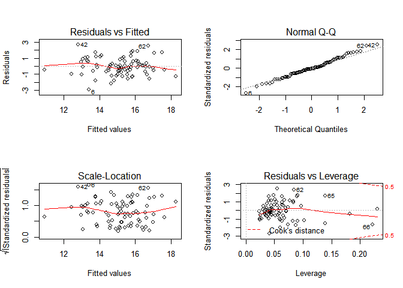<!-- -->

``` r
AIC(mult.fit)
```

    ## [1] 251.7721

``` r
AIC(reg_spline)
```

    ## [1] 252.5761
